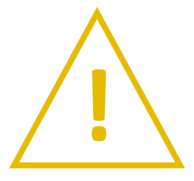

# MANUAL DE SOFTWARE

## INTRODUCCIÓN

Este Manual de Software proporciona la información necesaria para la utilización del Software LSST tanto por el personal
operario como por el personal de mantenimiento.

La empresa TEKNIKER no se responsabiliza de las consecuencias que deriven de modificaciones efectuadas en el software
del sistema, sin previa autorización por parte de TEKNIKER.

### USO DEL MANUAL

#### Simbología Utilizada en el Manual

<table>
<colgroup>
<col style="width: 8%" />
<col style="width: 91%" />
</colgroup>
<tbody>
<tr class="odd">
<td>🛑</td>
<td>
<strong>PELIGRO</strong>

LAS LLAMADAS DE PELIGRO SON UN MEDIO DE ATRAER LA ATENCIÓN HACIA INFORMACIÓN ESENCIAL O CRÍTICA. LOS AVISOS INCLUYEN
INFORMACIÓN SOBRE CONDICIONES, PRÁCTICAS O PROCEDIMIENTOS QUE SE DEBEN RESPETAR PARA EVITAR:

<ul>
<li>
LESIONES PERSONALES.
</li>
<li>
PÉRDIDA DE LA VIDA.
</li>
</ul></td>
</tr>
</tbody>
</table>

<table>
<colgroup>
<col style="width: 8%" />
<col style="width: 91%" />
</colgroup>
<tbody>
<tr class="odd">
<td>⚠️</td>
<td>
<strong>ATENCIÓN</strong>

Las llamadas de precaución se utilizan para describir las condiciones, prácticas o procedimientos que se deben
respetar para evitar:

<ul>
<li>
Dañar los equipos.
</li>
<li>
Destruir los equipos.
</li>
<li>
Poner en peligro la salud a largo plazo.
</li>
</ul></td>
</tr>
</tbody>
</table>

<table>
<colgroup>
<col style="width: 8%" />
<col style="width: 91%" />
</colgroup>
<tbody>
<tr class="odd">
<td>ℹ️</td>
<td>
<strong>NOTA</strong>

Las notas se emplean para resaltar información de especial importancia o interés relativo que:

<ul>
<li>

Se debe recordar.

</li>
<li>

Facilita una decisión correcta.

</li>
<li>

De lo contrario es difícil de encontrar.

</li>
</ul></td>
</tr>
</tbody>
</table>

### CONDICIONES GENERALES DE SEGURIDAD

{width=10%}

- 🛑 **EL PERSONAL QUE UTILIZA EL SOFTWARE DEBE SER PERSONAL CUALIFICADO O INSTRUIDO QUE HA RECIBIDO FORMACIÓN ESPECÍFICA
  EN EL USO DE ESTE SOFTWARE, INCLUYENDO LOS PELIGROS QUE PRESENTA EL MISMO, LAS MEDIDAS DE SEGURIDAD QUE DEBE ADOPTAR Y
  RESPETAR, ASÍ COMO LOS EQUIPOS DE PROTECCIÓN INDIVIDUAL QUE DEBE UTILIZAR Y LAS ACCIONES QUE NO DEBE EJECUTAR.**

- 🛑 **EL PERSONAL QUE UTILIZA ESTE SOFTWARE TIENE QUE CONOCER TODOS Y CADA UNO DE LOS RIESGOS ASOCIADOS A CADA ACCIÓN.**

- 🛑 **LOS PARÁMETROS BÁSICOS SOLO PODRÁN SER MODIFICADOS POR PERSONAL CON PERMISOS ESPECIALES E INSTRUIDOS PARA ELLO.**

- 🛑 **EL OPERADOR NO DESHABILITARÁ NINGÚN ELEMENTO DE SEGURIDAD.**

- 🛑 **SÓLO LOS OPERADORES FORMADOS Y AUTORIZADOS PODRÁN ANULAR (OVERRIDE) CAUSAS DE SEGURIDAD.**

- 🛑 **ANTES DE REALIZAR CUALQUIER OPERACIÓN CON ESTE SOFTWARE SE DEBEN LEER Y OBSERVAR LAS CONDICIONES GENERALES DE
  SEGURIDAD QUE FIGURAN EN EL MANUAL DE SEGURIDAD.**

{width=10%}

- ⚠️ **El personal de producción no debe modificar parámetros o ajustes que puedan afectar al funcionamiento básico del
  sistema.**

### COPYRIGHT

Este manual es propiedad intelectual de Tekniker. Se reserva todos los derechos. Se prohíbe la reproducción, imitación y
traducción total o parcial de este documento, así como la entrega a terceros, cualquiera que sea el soporte, electrónico
o papel, para todo propósito, sin el previo consentimiento por escrito de FUNDACIÓN TEKNIKER.

**© Tekniker 2022** - Todos los derechos reservados.
