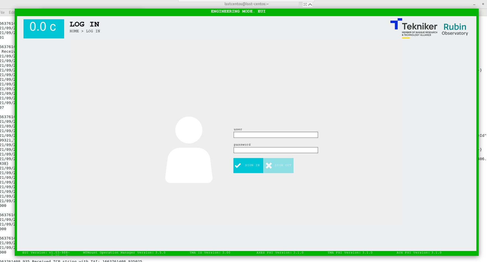
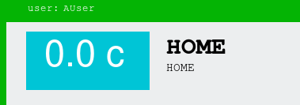
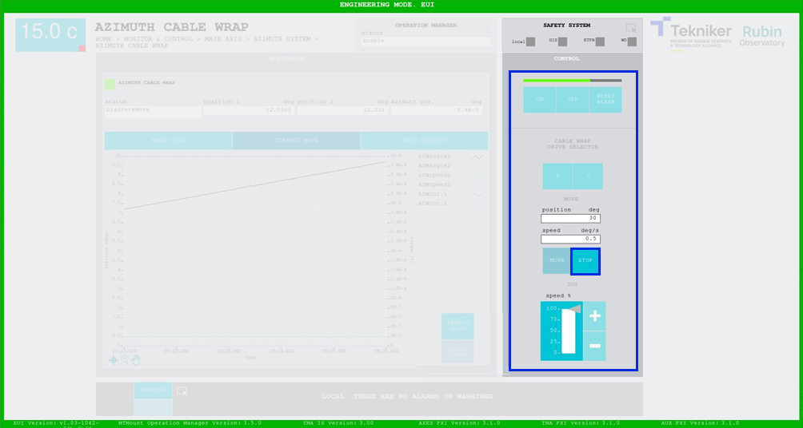
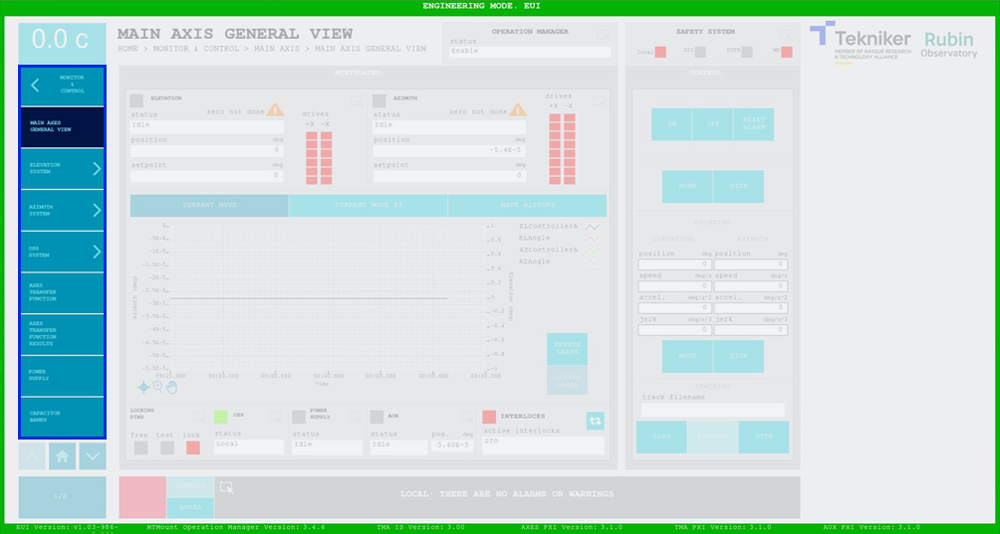
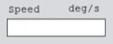
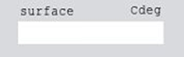

## DESCRIPCIÓN DE PANTALLAS

### CONSIDERACIONES PREVIAS

#### Usuarios

No todas las pantallas son accesibles para todos los usuarios, por lo que la pantalla de apertura de sesión
Figura 2‑1 requiere indicar qué usuario va a acceder al sistema y su respectiva contraseña.

Existen cuatro tipos de usuarios diferentes:

- **A_Viewer**: Se trata de usuarios de Visualización. Solamente permite la visualización, no puede comandar el
  telescopio.

- **B_Operator**: Se trata de usuarios de Operación. Permite comandar el telescopio, pero no puede manipular los
  settings.

- **C_Advance**: Se trata de usuarios Avanzados. Permite comandar el telescopio y manejar los settings más básicos,
  siempre dentro de los límites previamente establecidos para cada uno de ellos. Este tipo de usuario no puede guardar
  los settings de forma permanente, sus modificaciones son temporales.

- **D_Maintenance**: Se trata de usuarios de Mantenimiento. Permite realizar todas las operaciones y manejar todos los
  parámetros dentro de los límites previamente establecidos para cada uno de ellos.

{width=75%}

*Figura 2‑1. Pantalla apertura de sesión.*

Una vez iniciada la sesión, se muestra el usuario actual en la parte superior izquierda de la pantalla.

*Figure 2‑1.1. Usuario actual.*

#### Modos de funcionamiento

Existen tres modos de funcionamiento del telescopio:

- **EUI (Engineering User Interface)**: Permite controlar todos los elementos, así como modificar los parámetros
  (dependiendo del usuario).

- **HHD (Hand Held Device)**: Dirigido a dispositivos portátiles, posee ciertas restricciones con respecto al EUI.

- **CSC (Commandable SAL Components)**: Solamente permite la visualización de las pantallas.

#### Generalidades

Los iconos de la siguiente figura aparecen en la mayoría de las pantallas y funcionan todos como acceso a otra pantalla.

*Figura 2‑2. Acceso a otra pantalla.*

En el momento en el que se ejecute un comando, en cualquiera de las pantallas, se puede visualizar en la parte superior
derecha de la pantalla una barra de progreso, como la que se ve en la Figura 2‑3. También se puede ver cómo todos los
botones menos el "Stop" quedan deshabilitados.

*Figura 2‑3. Barra de progreso.*

Todas las pantallas de "Monitor&Control" poseen un menú de pantallas como se ve en la Figura 2‑4. Este menú también se
mantiene oculto mientras se ejecuta un comando, esto es así, porque no se puede salir de una ventana mientras se ejecuta
un comando.

*Figura 2‑4. Menú de pantallas.*

Por la misma razón, se deshabilitan todos los accesos directos que pueda haber en dicha pantalla.

Por último, se diferencian dos tipos de recuadros a lo largo de todas las pantallas:

- Recuadros con marco: son controles, permiten modificar los valores de su interior.

*Figura 2‑5. Ejemplo control.*

- Recuadros sin marco: son indicadores, solamente muestran valores.

*Figura 2‑6. Ejemplo indicador.*
