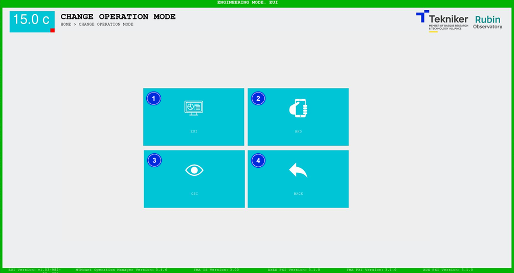
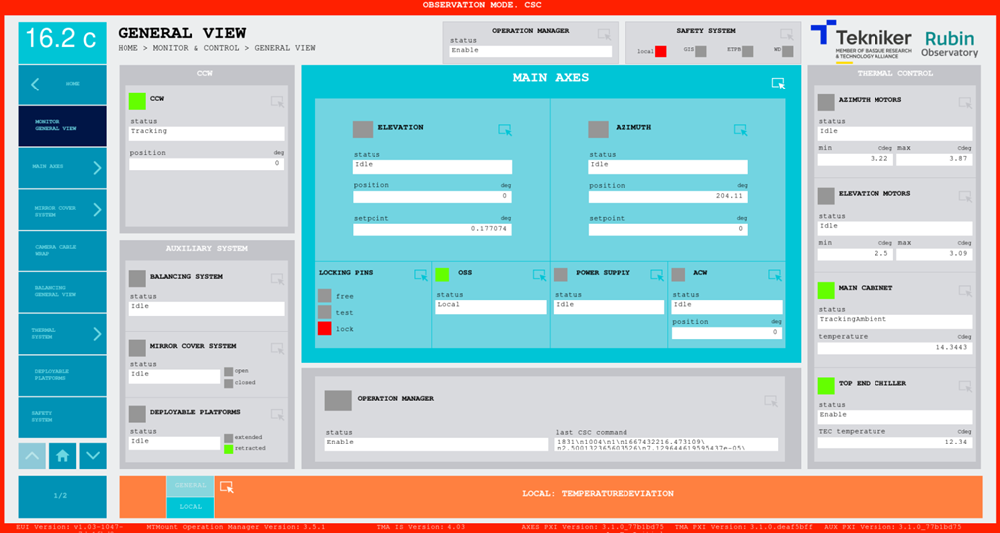

### CAMBIO DE MODO DE OPERACIÓN

En esta pantalla se efectúa el cambio del modo de control. Permite la elección entre los tres posibles modos de
operación mencionados en [consideraciones previas](00_Consideraciones_Previas.md).

El marco de la pantalla será verde si el maestro/comandante se corresponde con el dispositivo que se está usando. En el
resto de los dispositivos el marco se mostrará en rojo.

Por ejemplo, si el maestro es el EUI, este tendrá el marco de la pantalla verde, mientras que el HHD tendrá el marco
rojo.

> ℹ️ Mientras el maestro sea el HHD, ningún otro dispositivo puede solicitar el comando hasta que el HHD se desconecte o
> proporcione el comando a otro dispositivo.

*Figura 2‑8. Pantalla cambio de modo de operación.*

| ITEM | DESCRIPCIÓN                                                                                               |
|------|-----------------------------------------------------------------------------------------------------------|
| 1    | Permite cambiar el modo de control a EUI, y regresar a la pantalla ["HOME"](./01_Pantalla_Inicio_HOME.md) |
| 2    | Permite cambiar el modo de control a HHD, y regresar a la pantalla ["HOME"](./01_Pantalla_Inicio_HOME.md) |
| 3    | Permite cambiar el modo de control a CSC, y regresar a la pantalla ["HOME"](./01_Pantalla_Inicio_HOME.md) |
| 4    | Permite volver a la pantalla anterior ["HOME"](./01_Pantalla_Inicio_HOME.md)                              |

En la siguiente figura se visualiza un ejemplo de una pantalla en modo de operación CSC, es decir, sin tener el comando
y, por ello, con el marco rojo.

*Figura 2‑9. Pantalla con marco rojo.*
