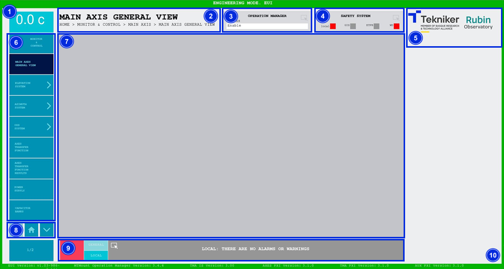

### ELEMENTOS COMUNES DE PANTALLAS

En la siguiente figura se pueden ver los elementos comunes que tienen tanto todas las pantallas de "Monitor & Control",
como todas las pantallas de "Settings".

*Figura 2‑10. Pantalla de elementos comunes.*

<table>
  <colgroup>
    <col style="width: 13%" />
    <col style="width: 86%" />
  </colgroup>
  <thead>
    <tr class="header">
      <th>ITEM</th>
      <th>DESCRIPCIÓN</th>
    </tr>
  </thead>
  <tbody>
    <tr class="odd">
      <td>1</td>
      <td>Muestra la temperatura del telescopio en tiempo real.</td>
    </tr>
    <tr class="even">
      <td>2</td>
      <td>Muestra el título de la pantalla y su correspondiente ruta.</td>
    </tr>
    <tr class="odd">
      <td>3</td>
      <td>
        

          Permite acceder a la pantalla [“Operation
          Manager”](../02_Monitor%26Control/035_PantallaOperationManager.md)
        

        

          Muestra los estados de “Operation Manager”,
          [ver](./03_Elementos_Comunes_de_Pantallas.md/#estados)
        

      </td>
    </tr>
    <tr class="even">
      <td>4</td>
      <td>
        

          Permite acceder a la pantalla [“Safety
          System”](../02_Monitor%26Control/034_PantallaSafetySystem.md) Muestra
          cuatro señales del sistema de seguridad:
        

        <ul>
          <li>
            

              Local: Se ilumina cuando existe algún interlock de seguridad que
              afecta al sistema de la ventana actual, el cual no permite el
              funcionamiento del sistema.
            

          </li>
          <li>
            

              GIS: Se ilumina cuando existe algún interlock que proviene del
              GIS, afecte o no al sistema de la ventana actual.
            

          </li>
          <li>
            

              ETPB: Se ilumina cuando hay alguna seta de emergencia pulsada.
            

          </li>
          <li>
            

              WD: Se ilumina cuando el sistema de seguridad detecta una falta de
              “watchdog”.
            

          </li>
        </ul>
      </td>
    </tr>
    <tr class="odd">
      <td>5</td>
      <td>Logotipos Tekniker y Rubin.</td>
    </tr>
    <tr class="even">
      <td>6</td>
      <td>
        

          Menú con acceso a pantallas, estas cambian dependiendo de la ventana
          en la que se encuentre el usuario.
        

        
Esta sección se mantiene oculta mientras se ejecuta un comando.

      </td>
    </tr>
    <tr class="odd">
      <td>7</td>
      <td>Espacio para ventanas de monitorización y control.</td>
    </tr>
    <tr class="even">
      <td>8</td>
      <td>
        
Las flechas permiten subir y bajar sobre el menú de ventanas.

        

          El softkey central permite volver a la pantalla de
          [“Home”](./01_Pantalla_Inicio_HOME.md)
        

      </td>
    </tr>
    <tr class="odd">
      <td>9</td>
      <td>
        

          Permite acceder a la pantalla [“Alarm
          History”](../02_Monitor%26Control/036_PantallaAlarmHistory.md)
        

        

          Softkey “GENERAL”: permite acceder a todas las alarmas sin filtrar.
        

        

          Softkey “LOCAL”: permite filtrar las alarmas y acceder únicamente a
          las relativas al subsistema, en caso de estar dentro de uno.
        

      </td>
    </tr>
    <tr class="even">
      <td>10</td>
      <td>
        Marco de la pantalla, su color cambia dependiendo del modo de operación,
        [ver](./00_Consideraciones_Previas.md)
      </td>
    </tr>
  </tbody>
</table>

#### Estados

Existen múltiples estados diferentes en la aplicación, y todos ellos vienen acompañados de un color representativo. pero
en este apartado se explican los tres más comunes con sus respectivos colores:

- **Gris**: Significa que el sistema se encuentra apagado. Este estado recibe el nombre de "Idle".

- **Verde**: Significa que el sistema se encuentra encendido. Este estado recibe el nombre de "Enable".

- **Rojo**: Significa que el sistema tiene un fallo. Este estado recibe el nombre de "Fault", pero también puede ir
  acompañado del nombre del propio fallo.
