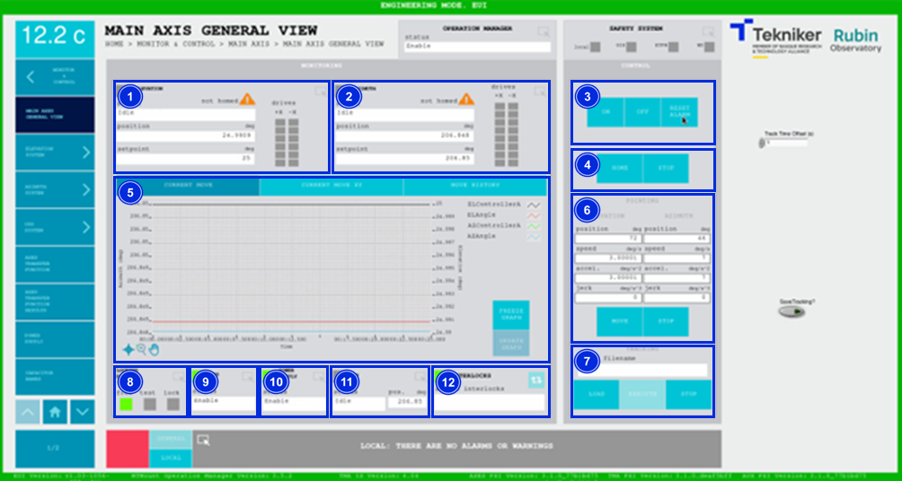
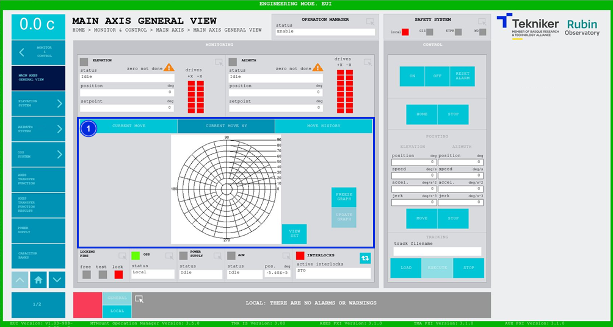
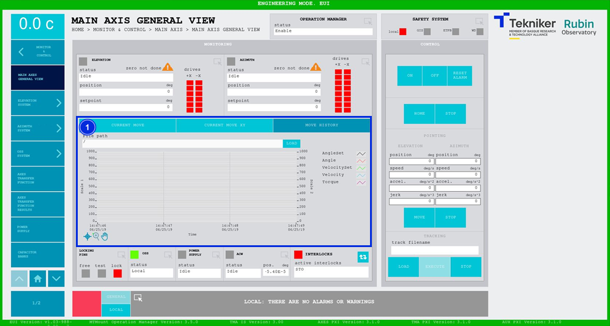
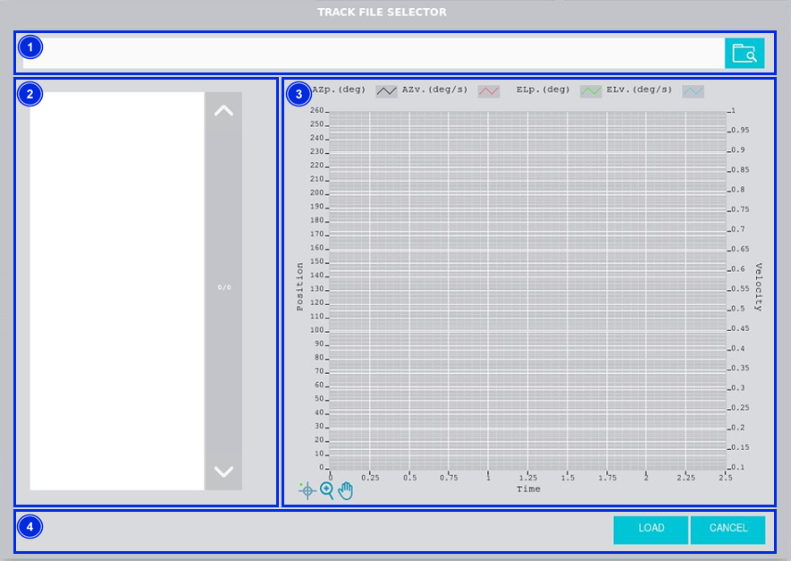

#### Pantalla Main Axis General View

##### Pantalla Main Axis General View -- Current Move

Esta pantalla permite comandar los ejes de azimuth y elevación al mismo tiempo.

> ℹ️ La pantalla no permite realizar nuevas operaciones hasta que los dos ejes completen la operación previamente solicitada.

*Figura 2‑12. Pantalla main axis general view - current move.*

<table>
<colgroup>
<col style="width: 13%" />
<col style="width: 86%" />
</colgroup>
<thead>
<tr class="header">
<th>ITEM</th>
<th>DESCRIPCIÓN</th>
</tr>
</thead>
<tbody>
<tr class="odd">
<td>1</td>
<td>
Permite acceder a la pantalla [“Elevation General View”](./002_PantallaElevationGeneralView.md)

Muestra el estado, la posición (en deg) y el setpoint (en deg) de “Elevation”.

Muestra el estado de cada motor mediante recuadros de colores:

<ul>
<li>
Rojo: Significa que el eje tiene un fallo.
</li>
<li>
Verde: Significa que el eje se encuentra encendido.
</li>
<li>
Gris: Significa que el eje no se encuentra encendido.
</li>
</ul>

El triángulo naranja junto con el texto “not homed” significa que falta hacer la referencia de los ejes.
</td>
</tr>
<tr class="even">
<td>2</td>
<td>
Permite acceder a la pantalla [“Azimuth General View”](./005_PantallaAzimuthGeneralView.md)

Muestra el estado, la posición (en deg) y el setpoint (en deg) de “Azimuth”.

Muestra el estado de cada motor mediante recuadros de colores:

<ul>
<li>
Rojo: Significa que el eje tiene un fallo.
</li>
<li>
Verde: Significa que el eje se encuentra encendido.
</li>
<li>
Gris: Significa que el eje no se encuentra encendido.
</li>
</ul>

El triángulo naranja junto con el texto “not homed” significa que falta hacer la referencia de los ejes.
</td>
</tr>
<tr class="odd">
<td>3</td>
<td>
Softkey “ON”: Permite encender los dos ejes, siempre y cuando estén en “Idle” y no tengan ningún interlock
activo. Los interlock activos se muestran en el item 12 de esta misma tabla.

Softkey “OFF”: Permite apagar ambos ejes.

Softkey “RESET ALARM”: Permite resetear el estado de alarma para ambos ejes o resetear los interlocks en caso de
haberlos.
</td>
</tr>
<tr class="even">
<td>4</td>
<td>
Softkey “HOME”: Permite buscar la referencia de los ejes.

Softkey “STOP”: Permite detener el movimiento de los ejes. Esta operación es permitida siempre que se esté ejecutando
un movimiento, sin tener que esperar a que termine. Es la única operación que está permitida cuando hay una operación de
movimiento en marcha.
</td>
</tr>
<tr class="odd">
<td>5</td>
<td>
Muestra el gráfico de azimuth y elevación en tiempo real.

Softkey “FREEZE GRAPH”: Permite congelar el gráfico.

Softkey “UPDATE GRAPH”: Permite actualizar el gráfico, tras haber sido congelado.
</td>
</tr>
<tr class="even">
<td>6</td>
<td>
Permite definir las especificaciones de posición (en deg), velocidad (en deg/s), aceleración (en
deg/s2) y jerk (en deg/s3) tanto de elevación como de azimuth, para realizar un movimiento.

Softkey “MOVE”: Permite realizar el movimiento de los ejes con las especificaciones previamente introducidas.

Softkey “STOP”: Permite detener el movimiento de los ejes.
</td>
</tr>
<tr class="odd">
<td>7</td>
<td>
Softkey “LOAD”: permite acceder a la ventana de selección de archivos de trayectoria fijada, [ver](#pantalla-tracking).

Softkey “EXECUTE”: Permite ejecutar el archivo, una vez seleccionado.

Softkey “STOP”: Permite detener el movimiento de los ejes.
</td>
</tr>
<tr class="even">
<td>8</td>
<td>
Permite acceder a la pantalla [“Locking Pins General View”](./004_PantallaLockingPins.md)

Muestra el estado de los pasadores, y activa el led con el color correspondiente:

<ul>
<li>
“FREE”: Significa que los pasadores se encuentran libres, y se ilumina de color verde.
</li>
<li>
“TEST”: Significa que los pasadores se encuentran en test, y se ilumina de color naranja.
</li>
<li>
“LOCK”: Significa que los pasadores se encuentran bloqueados, y se ilumina de color rojo.
</li>
</ul></td>
</tr>
<tr class="odd">
<td>9</td>
<td>Muestra el estado y permite acceder a la pantalla de [“OSS General View”](./008_PantallaOSSGeneralView.md)</td>
</tr>
<tr class="even">
<td>10</td>
<td>Muestra el estado y permite acceder a la pantalla de [“Power SupplyGeneral View”](./018_PantallaPowerSupply.md)</td>
</tr>
<tr class="odd">
<td>11</td>
<td>
Permite acceder a la pantalla [“Azimuth Cable Wrap”](./006_PantallaAzimuthCableWrap.md)

Muestra el estado y la posición (en deg) de “Azimuth Cable Wrap (ACW)”.
</td>
</tr>
<tr class="even">
<td>12</td>
<td>
Softkey azul permite navegar entre los interlocks que se encuentran activos, en caso de haber más de uno.

Al haber algún interlock activo, el recuadro superior se visualiza de color rojo. Si no hay interlocks activos, el
recuadro se visualizará en verde y no se podrá pulsar el softkey azul.
</td>
</tr>
</tbody>
</table>

##### Pantalla Main Axis General View -- Current Move XY

Esta pantalla permite comandar los ejes de azimuth y elevación al mismo tiempo, esta vez representados en los ejes X e
Y.

*Figura 2‑13. Pantalla main axis general view - current move XY.*

<table>
<colgroup>
<col style="width: 13%" />
<col style="width: 86%" />
</colgroup>
<thead>
<tr class="header">
<th>ITEM</th>
<th>DESCRIPCIÓN</th>
</tr>
</thead>
<tbody>
<tr class="odd">
<td>1</td>
<td>
Muestra el gráfico de azimuth y elevación representados en los ejes X e Y en tiempo real.

Softkey “FREEZE GRAPH”: Permite congelar el gráfico.

Softkey “UPDATE GRAPH”: Permite actualizar el gráfico, tras haber sido congelado.
</td>
</tr>
</tbody>
</table>

##### Pantalla Main Axis General View -- Move History

Esta pantalla muestra y permite cargar los cinco últimos movimientos de azimuth y elevación, siendo el número 1 el
último.

*Figura 2‑14. Pantalla main axis general view - move history.*

<table>
<colgroup>
<col style="width: 13%" />
<col style="width: 86%" />
</colgroup>
<thead>
<tr class="header">
<th>ITEM</th>
<th>DESCRIPCIÓN</th>
</tr>
</thead>
<tbody>
<tr class="odd">
<td>1</td>
<td>
Softkey “LOAD”: Permite cargar los últimos cinco movimientos.

Tras seleccionar el movimiento deseado, permite visualizarlo en el gráfico.
</td>
</tr>
</tbody>
</table>

###### Pantalla Tracking

Esta pantalla se muestra a modo de "Popup" al presionar sobre el botón "LOAD" en la pantalla "Pantalla Main Axis General
View", permite seleccionar un archivo con una trayectoria fijada. Esta trayectoria seleccionada será ejecutada
presionando el botón "EXECUTE" de la pantalla "Pantalla Main Axis General View".

*Figura 2‑15. Pantalla tracking.*

<table>
<colgroup>
<col style="width: 13%" />
<col style="width: 86%" />
</colgroup>
<thead>
<tr class="header">
<th>ITEM</th>
<th>DESCRIPCIÓN</th>
</tr>
</thead>
<tbody>
<tr class="odd">
<td>1</td>
<td>Permite seleccionar el directorio donde se encuentran las trayectorias a cargar.</td>
</tr>
<tr class="even">
<td>2</td>
<td>Muestra y permite seleccionar el nombre del archivo, que se graficará en el item 3 de esta tabla.</td>
</tr>
<tr class="odd">
<td>3</td>
<td>Muestra el gráfico del archivo seleccionado.</td>
</tr>
<tr class="even">
<td>4</td>
<td>
Softkey “LOAD”: Permite cargar el archivo previamente seleccionado.

Softkey “CANCEL”: Permite cancelar la acción y regresar a la pantalla anterior.
</td>
</tr>
</tbody>
</table>
