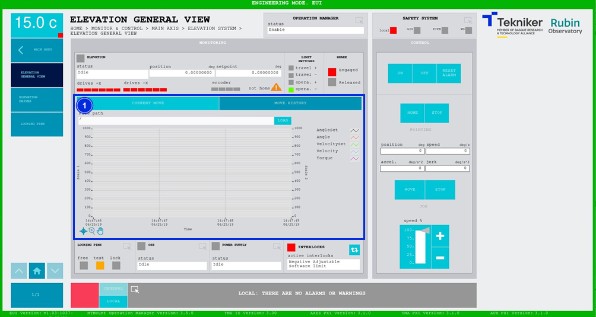

#### Pantalla Elevation General View

##### Pantalla Elevation General View -- Current Move

Esta pantalla muestra y permite controlar los aspectos generales de elevación.

*Figura 2‑16. Pantalla elevation general view - current move.*

<table>
<colgroup>
<col style="width: 13%" />
<col style="width: 86%" />
</colgroup>
<thead>
<tr class="header">
<th>ITEM</th>
<th>DESCRIPCIÓN</th>
</tr>
</thead>
<tbody>
<tr class="odd">
<td>1</td>
<td>
Muestra el estado, la posición (en deg) y el setpoint (en deg) de la elevación.

Muestra el estado de cada motor de elevación y del encoder:

<ul>
<li>
Rojo: Significa que existe un fallo.
</li>
<li>
Verde: Significa que se encuentra encendido.
</li>
<li>
Gris: Significa que se encuentra apagado.
</li>
</ul>

El triángulo naranja junto con el texto “not homed” significa que falta hacer la referencia de los ejes.

Muestra el estado de los límites de recorrido. Siendo los límites de recorrido más restrictivos “opera. +” y “opera.
–”, y los límites de recorrido completo “travel +” y “travel –”. Se ilumina de color verde el recuadro correspondiente
al límite que se activa.

Muestra si el freno está activado o no. Representado mediante un recuadro rojo la opción “Engaged” cuando lo esté, o
con un recuadro verde en “Released” cuando no lo esté.

Se visualiza un gráfico con la posición y velocidad en tiempo real.

Softkey “FREEZE GRAPH”: permite congelar el gráfico.

Softkey “UPDATE GRAPH”: permite actualizar el gráfico, tras haber sido congelado.
</td>
</tr>
<tr class="even">
<td>2</td>
<td>
Softkey “ON”: Permite encender el eje, solamente si está en “Idle” y no hay ningún interlock activo.

Softkey “OFF”: Permite apagar el eje.

Softkey “RESET ALARM”: Permite resetear el sistema del estado de alarma en el que se encuentra o resetear el
interlock en caso de haberlo, mientras está en “Idle” para poder hacer “ON”.
</td>
</tr>
<tr class="odd">
<td>3</td>
<td>
Permite definir la posición (en deg), velocidad (en deg/s), aceleración (en deg/s2) y jerk (en
deg/s3) de la elevación.

Softkey “HOME”: Permite buscar la referencia de los ejes.

Softkeys “STOP”: Permiten detener el movimiento de los ejes.

Softkey “MOVE”: Permite realizar el movimiento de los ejes con las especificaciones previamente introducidas.

Softkeys “+” o “-”: Permiten hacer un movimiento a velocidad constante en dirección positiva o negativa
respectivamente. De esta manera, se ajusta el porcentaje de la velocidad por defecto definida en los parámetros con el
slider vertical.
</td>
</tr>
<tr class="even">
<td>4</td>
<td>
Permite acceder a la pantalla [“Locking Pins General View”](./004_PantallaLockingPins.md)

Muestra el estado de los pasadores, y activa el led con el color correspondiente:

<ul>
<li>
“FREE”: Significa que los pasadores se encuentran libres, y se ilumina de color verde.
</li>
<li>
“TEST”: Significa que los pasadores se encuentran en test, y se ilumina de color naranja.
</li>
<li>
“LOCK”: Significa que los pasadores se encuentran bloqueados, y se ilumina de color rojo.
</li>
</ul></td>
</tr>
<tr class="odd">
<td>5</td>
<td>Muestra el estado y permite acceder a la pantalla de [“OSS General View”](./008_PantallaOSSGeneralView.md)</td>
</tr>
<tr class="even">
<td>6</td>
<td>Muestra el estado y permite acceder a la pantalla de [“Power SupplyGeneral View”](./018_PantallaPowerSupply.md)</td>
</tr>
<tr class="odd">
<td>7</td>
<td>
Softkey azul permite navegar entre los interlocks que se encuentran activos, en caso de haber más de uno.

Al haber algún interlock activo, el recuadro superior se visualiza de color rojo. Si no hay interlocks activos, el
recuadro se visualizará en verde y no se podrá pulsar el softkey azul.
</td>
</tr>
</tbody>
</table>

##### Pantalla Elevation General View -- Move History

Esta pantalla muestra y permite cargar los últimos cinco movimientos de elevación, siendo el número 1 el último.

*Figura 2‑17. Pantalla elevation general view - move history.*

<table>
<colgroup>
<col style="width: 13%" />
<col style="width: 86%" />
</colgroup>
<thead>
<tr class="header">
<th>ITEM</th>
<th>DESCRIPCIÓN</th>
</tr>
</thead>
<tbody>
<tr class="odd">
<td>1</td>
<td>
Softkey “LOAD”: Permite cargar los últimos cinco movimientos.

Tras seleccionar el movimiento deseado, permite visualizarlo en el gráfico.
</td>
</tr>
</tbody>
</table>
