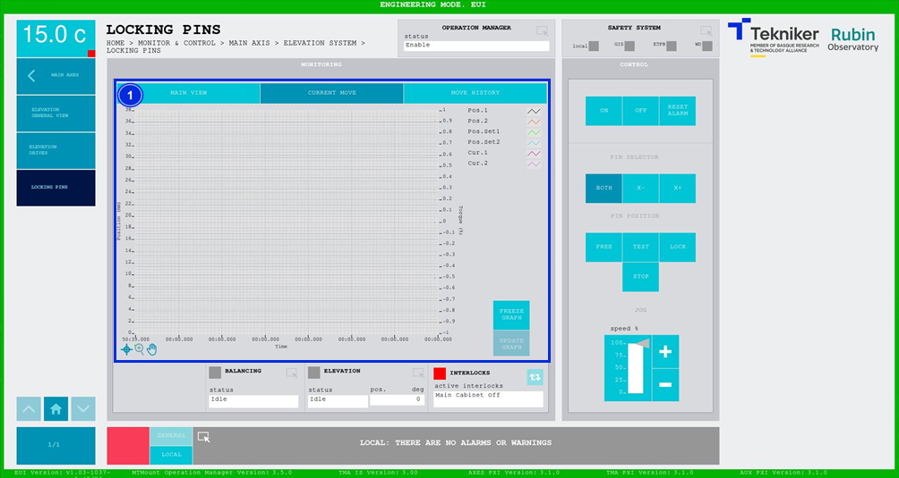
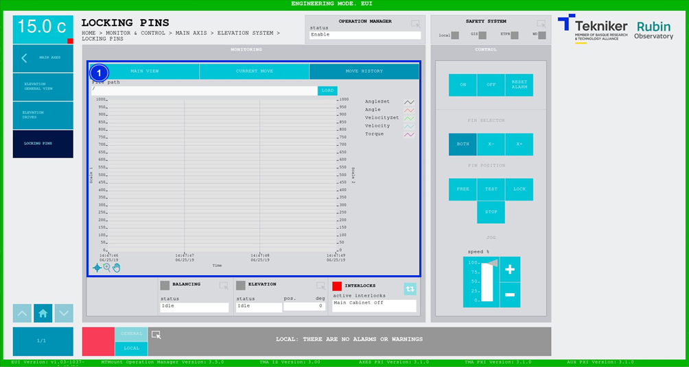

#### Pantalla Locking Pins

##### Pantalla Locking Pins -- Main View

Esta pantalla muestra y permite controlar los pasadores de bloqueo del eje de elevación.

*Figura 2‑20. Pantalla locking pins - main view.*

<table>
<colgroup>
<col style="width: 13%" />
<col style="width: 86%" />
</colgroup>
<thead>
<tr class="header">
<th>ITEM</th>
<th>DESCRIPCIÓN</th>
</tr>
</thead>
<tbody>
<tr class="odd">
<td>1</td>
<td>
Muestra el estado de los pasadores de bloqueo:

<ul>
<li>
“Free”, en verde. En esta posición, el movimiento del eje de elevación está permitido.
</li>
<li>
“Test”, en naranja. En esta posición, se realiza el equilibrado fino del eje de elevación.
</li>
</ul>
<table>
<colgroup>
<col style="width: 10%" />
<col style="width: 89%" />
</colgroup>
<tbody>
<tr class="odd">
<td>⚠️</td>
<td>Esta posición (test) supone un riesgo para el telescopio, los movimientos permitidos son inferiores a 0,2 deg.</td>
</tr>
</tbody>
</table>
<ul>
<li>
“Lock”, en rojo, no permite el movimiento de elevación.
</li>
</ul>

Muestra el estado y la posición (en mm) de los pasadores de bloqueo. Además, el recuadro junto a “run/alarm” se
ilumina con el color correspondiente al estado del pasador.
</td>
</tr>
<tr class="even">
<td>2</td>
<td>
Softkey “ON”: Permite encender el pasador, solamente si está en “Idle” y no hay ningún interlock activo.

Softkey “OFF”: Permite apagar el pasador.

Softkey “RESET ALARM”: Permite resetear el sistema del estado de alarma en el que se encuentra o resetear el
interlock en caso de haberlo.
</td>
</tr>
<tr class="odd">
<td>3</td>
<td>
Softkey “BOTH”: Permite seleccionar ambos pasadores.

Softkey “X-”: Permite seleccionar el pasador situado en el soporte “X-“.

Softkey “X+”: Permite seleccionar el pasador situado en el soporte “X+”.

Softkey “FREE”: Permite mover a la posición de liberado el pasador previamente seleccionado.

Softkey “TEST”: Permite mover a la posición de test del pasador previamente seleccionado.

Softkey “LOCK”: Permite mover a la posición de bloqueo el pasador previamente seleccionado.

Softkey “STOP”: Permite parar movimiento del pasador previamente seleccionado.

Softkeys “+” o “-”: Permiten hacer un movimiento a velocidad constante en dirección positiva o negativa
respectivamente. De esta manera, se ajusta el porcentaje de la velocidad por defecto definida en los parámetros con el
slider vertical.
</td>
</tr>
<tr class="even">
<td>4</td>
<td>Muestra el estado y permite acceder a la pantalla [“Balancing General View”](./024_PantallaBalancingGeneralView.md)</td>
</tr>
<tr class="odd">
<td>5</td>
<td>
Muestra el estado y la posición (en deg) de “Elevation”.

Permite acceder a la pantalla [“Elevation General View”](./002_PantallaElevationGeneralView.md)
</td>
</tr>
<tr class="even">
<td>6</td>
<td>
Softkey azul permite navegar entre los interlocks que se encuentran activos, en caso de haber más de uno.

Al haber algún interlock activo, el recuadro superior se visualiza de color rojo. Si no hay interlocks activos, el
recuadro se visualizará en verde y no se podrá pulsar el softkey azul.
</td>
</tr>
</tbody>
</table>

##### Pantalla Locking Pins -- Current Move

Esta pantalla muestra un gráfico con el movimiento de los pasadores de bloqueo en tiempo real.

*Figura 2‑21. Pantalla locking pins - current move.*

<table>
<colgroup>
<col style="width: 13%" />
<col style="width: 86%" />
</colgroup>
<thead>
<tr class="header">
<th>ITEM</th>
<th>DESCRIPCIÓN</th>
</tr>
</thead>
<tbody>
<tr class="odd">
<td>1</td>
<td>
Muestra el gráfico del movimiento de los pasadores de bloqueo en tiempo real.

Softkey “FREEZE GRAPH”: Permite congelar el gráfico.

Softkey “UPDATE GRAPH”: Permite actualizar el gráfico, tras haber sido congelado.
</td>
</tr>
</tbody>
</table>

##### Pantalla Locking Pins -- Move History

Esta pantalla muestra y permite cargar los últimos cinco movimientos de los pasadores de bloqueo, siendo el número 1 el
último.

*Figura 2‑22. Pantalla locking pins - move history.*

<table>
<colgroup>
<col style="width: 13%" />
<col style="width: 86%" />
</colgroup>
<thead>
<tr class="header">
<th>ITEM</th>
<th>DESCRIPCIÓN</th>
</tr>
</thead>
<tbody>
<tr class="odd">
<td>1</td>
<td>
Softkey “LOAD”: Permite cargar los últimos cinco movimientos.

Tras seleccionar el movimiento deseado, permite visualizarlo en el gráfico.
</td>
</tr>
</tbody>
</table>
