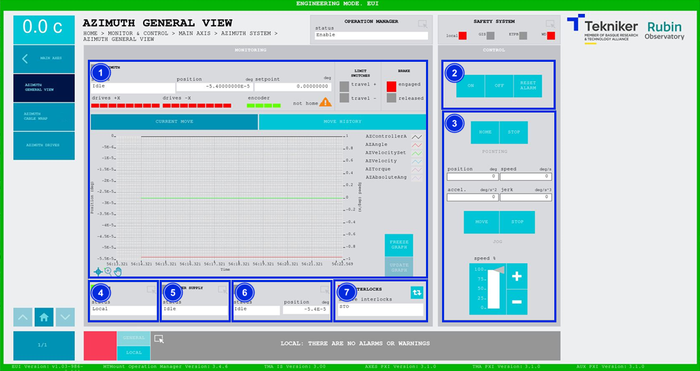
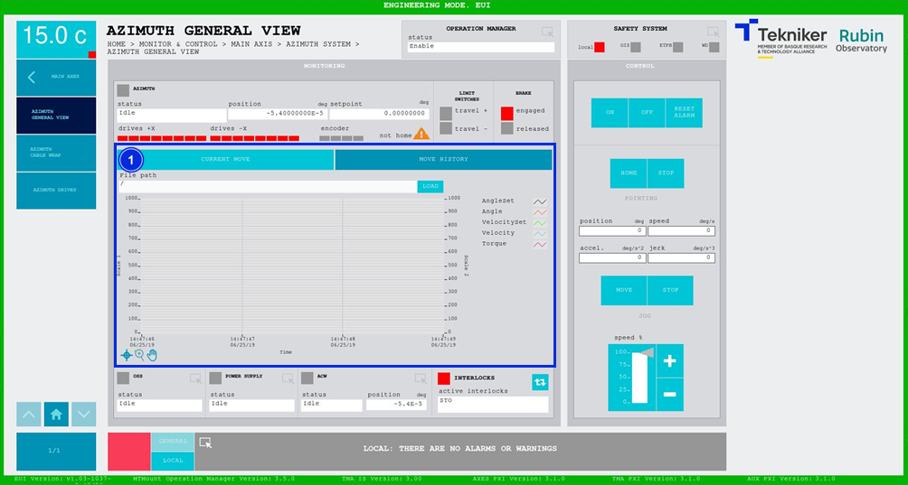

#### Pantalla Azimuth General View

##### Pantalla Azimuth General View -- Current Move

Esta pantalla muestra y permite controlar los aspectos generales del eje de azimuth.

*Figura 2‑23. Pantalla azimuth general view - current move.*

<table>
<colgroup>
<col style="width: 13<col style="width: 86</colgroup>
<thead>
<tr class="header">
<th>ITEM</th>
<th>DESCRIPCIÓN</th>
</tr>
</thead>
<tbody>
<tr class="odd">
<td>1</td>
<td>
Muestra el estado, la posición (en deg) y el setpoint (en deg) de azimuth.

Muestra el estado de cada motor de azimuth y del encoder:

<ul>
<li>
Rojo: Significa que existe un fallo.
</li>
<li>
Verde: Significa que se encuentra encendido.
</li>
<li>
Gris: Significa que se encuentra apagado.
</li>
</ul>

El triángulo naranja junto con el texto “not homed” significa que falta hacer la referencia de los ejes.

Muestra el estado de los límites de recorrido. Se ilumina en verde el recuadro correspondiente al límite que se
activa.

Muestra si el freno esta activado o no. Representado mediante un recuadro rojo la opción “Engaged” cuando lo esté, o
con un cuadro verde en “Released” cuando no.

Se visualiza un gráfico con la posición y velocidad en tiempo real.

Softkey “FREEZE GRAPH”: Permite congelar el gráfico.

Softkey “UPDATE GRAPH”: Permite actualizar el gráfico, tras haber sido congelado.
</td>
</tr>
<tr class="even">
<td>2</td>
<td>
Softkey “ON”: Permite encender el eje, solamente si está en “Idle” y no hay ningún interlock activo.

Softkey “OFF”: Permite apagar el eje.

Softkey “RESET ALARM”: Permite resetear el sistema del estado de alarma en el que se encuentra o resetear el
interlock en caso de haberlo.
</td>
</tr>
<tr class="odd">
<td>3</td>
<td>
Permite definir la posición (en deg), velocidad (en deg/s), aceleración (en deg/s2) y jerk (en
deg/s3) de azimuth.

Softkey “HOME”: Permite buscar la referencia del eje.

Softkeys “STOP”: Permiten detener el movimiento del eje.

Softkey “MOVE”: Permite realizar el movimiento del eje con las especificaciones previamente introducidas.

Softkeys “+” o “-”: Permiten hacer un movimiento a velocidad constante en dirección positiva o negativa
respectivamente. De esta manera, se ajusta el porcentaje de la velocidad por defecto definida en los parámetros con el
slider vertical.
</td>
</tr>
<tr class="even">
<td>4</td>
<td>Muestra el estado y permite acceder a la pantalla de [“OSS General View”](./008_PantallaOSSGeneralView.md)</td>
</tr>
<tr class="odd">
<td>5</td>
<td>Muestra el estado y permite acceder a la pantalla de [“Power SupplyGeneral View”](./018_PantallaPowerSupply.md)</td>
</tr>
<tr class="even">
<td>6</td>
<td>
Permite acceder a la pantalla [“Azimuth Cable Wrap”](./006_PantallaAzimuthCableWrap.md) 2.5.2.3.2.

Muestra el estado y la posición (en deg) de “Azimuth Cable Wrap (ACW)”.
</td>
</tr>
<tr class="odd">
<td>7</td>
<td>
Softkey azul permite navegar entre los interlocks que se encuentran activos, en caso de haber más de uno.

Al haber algún interlock activo, el recuadro superior se visualiza de color rojo. Si no hay interlocks activos, el
recuadro se visualizará en verde y no se podrá pulsar el softkey azul.
</td>
</tr>
</tbody>
</table>

##### Pantalla Azimuth General View -- Move History

Esta pantalla muestra y permite cargar los últimos cinco movimientos de azimuth, siendo el número 1 el último.

*Figura 2‑24. Pantalla azimuth general view - move history.*

<table>
<colgroup>
<col style="width: 13<col style="width: 86</colgroup>
<thead>
<tr class="header">
<th>ITEM</th>
<th>DESCRIPCIÓN</th>
</tr>
</thead>
<tbody>
<tr class="odd">
<td>1</td>
<td>
Softkey “LOAD”: Permite cargar los últimos cinco movimientos.

Tras seleccionar el movimiento deseado, permite visualizarlo en el gráfico.
</td>
</tr>
</tbody>
</table>
