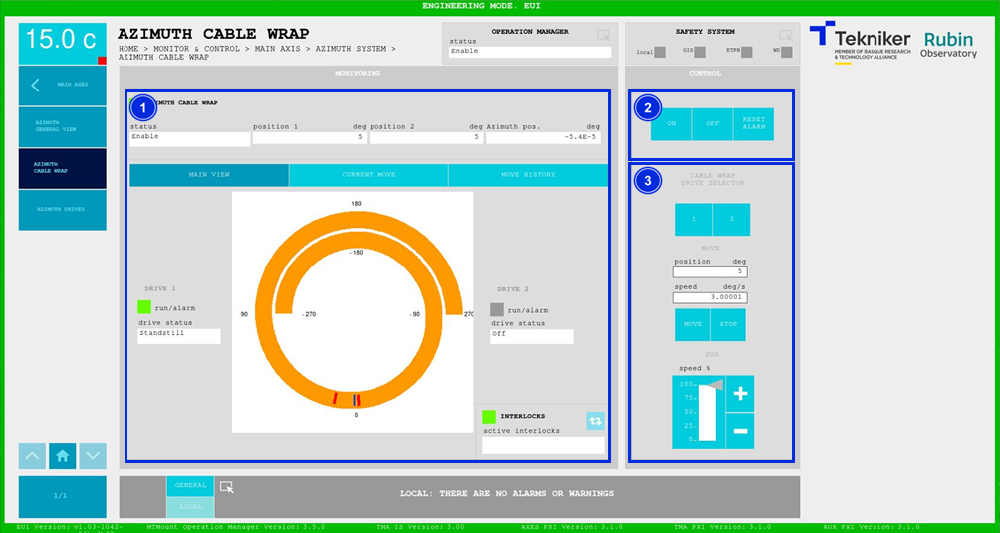
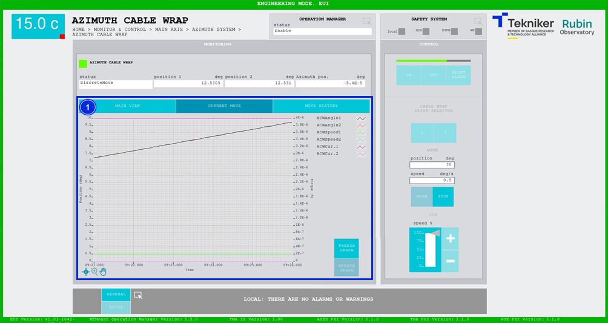
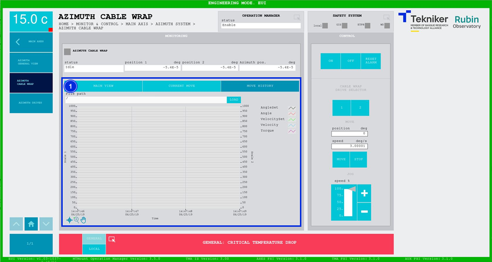

#### Pantalla Azimuth Cable Wrap

##### Pantalla Azimuth Cable Wrap -- Main View

Esta pantalla muestra y permite controlar el estado y movimiento de "Azimuth Cable Wrap (ACW)".

*Figura 2‑25. Pantalla azimuth cable wrap - main view.*

<table>
<colgroup>
<col style="width: 13<col style="width: 86</colgroup>
<thead>
<tr class="header">
<th>ITEM</th>
<th>DESCRIPCIÓN</th>
</tr>
</thead>
<tbody>
<tr class="odd">
<td>1</td>
<td>
Muestra el estado, la posición 1 (en deg), la posición 2 (en deg) y la posición azimuth (en deg) de “Azimuth
Cable Wrap (ACW)”.

La posición 1 hace referencia al motor 1 del rotador de cables, y la posición 2 hace referencia al motor 2. El
sistema nunca usará ambos motores al mismo tiempo, están por redundancia.

Muestra el estado de cada motor. Además, el recuadro junto a “run/alarm” se ilumina con el color correspondiente al
estado del motor.

Muestra de manera gráfica la ubicación de azimuth (en azul), con respecto a los límites establecidos (en rojo). En
cuanto azimuth se aproxima a uno de los límites, se muestra el recorrido de color naranja. De lo contrario, el recorrido
se muestra de color gris.

Softkey azul permite navegar entre los interlocks que se encuentran activos, en caso de haber más de uno.

Al haber algún interlock activo, el recuadro superior se visualiza de color rojo. Si no hay interlocks activos, el
recuadro se visualizará en verde y no se podrá pulsar el softkey azul.
</td>
</tr>
<tr class="even">
<td>2</td>
<td>
Softkey “ON”: Permite encender el sistema, solamente si está en “Idle” y no hay ningún interlock activo.

Softkey “OFF”: Permite apagar el sistema.

Softkey “RESET ALARM”: Permite resetear el sistema del estado de alarma en el que se encuentra o resetear el
interlock en caso de haberlo.
</td>
</tr>
<tr class="odd">
<td>3</td>
<td>
Permite definir la posición (en deg) y la velocidad (en deg/s) de “Azimuth Cable Wrap (ACW)”.

Softkeys “1” y “2”: Permiten seleccionar el motor deseado.

Softkey “MOVE”: Permite realizar el movimiento del sistema, en este caso el “Azimuth Cable Wrap (ACW)”.

Softkeys “STOP”: Permiten detener el movimiento del sistema.

Softkeys “+” o “-”: Permiten hacer un movimiento a velocidad constante en dirección positiva o negativa
respectivamente. De esta manera, se ajusta el porcentaje de la velocidad por defecto definida en los parámetros con el
slider vertical.
</td>
</tr>
</tbody>
</table>

##### Pantalla Azimuth Cable Wrap -- Current Move

Esta pantalla muestra un gráfico con el movimiento de "Azimuth Cable Wrap (ACW)" en tiempo real.

*Figura 2‑26. Pantalla azimuth cable wrap - current move.*

<table>
<colgroup>
<col style="width: 13<col style="width: 86</colgroup>
<thead>
<tr class="header">
<th>ITEM</th>
<th>DESCRIPCIÓN</th>
</tr>
</thead>
<tbody>
<tr class="odd">
<td>1</td>
<td>
Muestra el gráfico del movimiento de “Azimuth Cable Wrap (ACW)” en tiempo real.

Softkey “FREEZE GRAPH”: Permite congelar el gráfico.

Softkey “UPDATE GRAPH”: Permite actualizar el gráfico, tras haber sido congelado.
</td>
</tr>
</tbody>
</table>

##### Pantalla Azimuth Cable Wrap -- Move History

Esta pantalla muestra y permite cargar los últimos cinco movimientos de "Azimuth Cable Wrap (ACW)", siendo el número 1
el último.

*Figura 2‑27. Pantalla azimuth cable wrap - move history.*

<table>
<colgroup>
<col style="width: 13<col style="width: 86</colgroup>
<thead>
<tr class="header">
<th>ITEM</th>
<th>DESCRIPCIÓN</th>
</tr>
</thead>
<tbody>
<tr class="odd">
<td>1</td>
<td>
Softkey “LOAD”: Permite cargar los últimos cinco movimientos.

Tras seleccionar el movimiento deseado, permite visualizarlo en el gráfico.
</td>
</tr>
</tbody>
</table>
