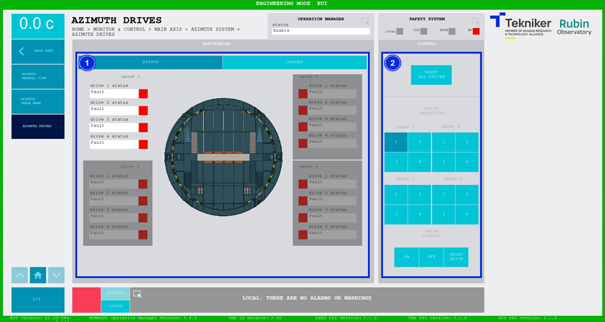
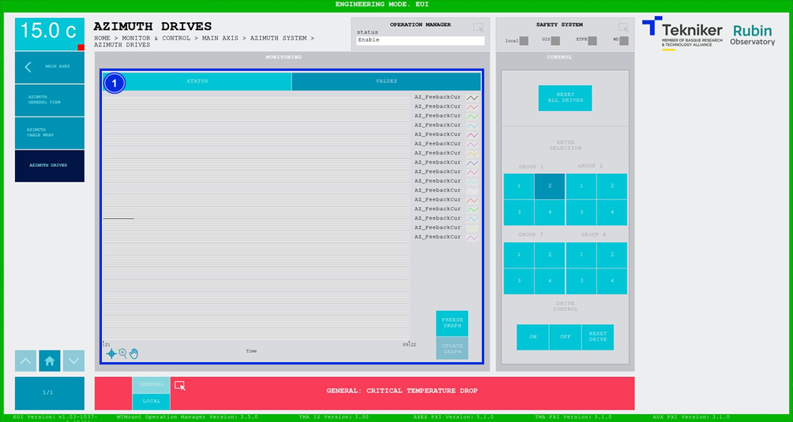

#### Pantalla Azimuth Drives

##### Pantalla Azimuth Drives - Status

Esta pantalla muestra y permite controlar los estados y valores de los motores de azimuth.

*Figura 2‑28. Pantalla azimuth drives - status.*

<table>
<colgroup>
<col style="width: 13<col style="width: 86</colgroup>
<thead>
<tr class="header">
<th>ITEM</th>
<th>DESCRIPCIÓN</th>
</tr>
</thead>
<tbody>
<tr class="odd">
<td>1</td>
<td>
Muestra el estado de los motores de azimuth. Existen tres estados diferentes:

<ul>
<li>
“Idle”, de color gris, significa que el motor se encuentra apagado.
</li>
<li>
“Fault”, de color rojo, significa que el motor tiene un fallo.
</li>
<li>
“Parked”, de color gris, significa que el motor está deshabilitado y no se encenderá.
</li>
<li>
“Enable”, de color verde, significa que el motor se encuentra encendido.
</li>
</ul></td>
</tr>
<tr class="even">
<td>2</td>
<td>
Softkey “RESET ALL DRIVES”: Permite resetear todos los motores.

Softkeys “1”, “2”, “3”, y “4”: Permiten seleccionar los motores deseados.

Softkey “ON”: Permite encender el motor previamente seleccionado.

Softkey “OFF”: Permite apagar el motor previamente seleccionado, de manera que no se habilite al encender el eje,
cambiará al estado de “Parked”.

Softkey “RESET DRIVE”: Permite resetear el motor previamente seleccionado.
</td>
</tr>
</tbody>
</table>

##### Pantalla Azimuth Drives - Values

Esta pantalla muestra un gráfico con los valores de corriente de los motores azimuth en tiempo real.

*Figura 2‑29. Pantalla azimuth drives - values.*

<table>
<colgroup>
<col style="width: 13<col style="width: 86</colgroup>
<thead>
<tr class="header">
<th>ITEM</th>
<th>DESCRIPCIÓN</th>
</tr>
</thead>
<tbody>
<tr class="odd">
<td>1</td>
<td>
Muestra un gráfico con los valores de los motores de azimuth en tiempo real.

Softkey “FREEZE GRAPH”: Permite congelar el gráfico.

Softkey “UPDATE GRAPH”: Permite actualizar el gráfico, tras haber sido congelado.
</td>
</tr>
</tbody>
</table>
