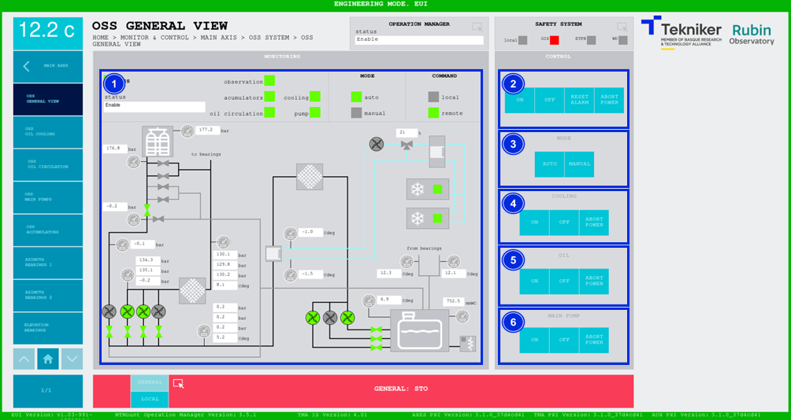
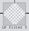
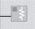

#### Pantalla OSS General View

Esta pantalla muestra y permite controlar los aspectos generales del "Oil Supply System (OSS)".

*Figura 2‑30. Pantalla OSS general view.*

<table>
<colgroup>
<col style="width: 13<col style="width: 86</colgroup>
<thead>
<tr class="header">
<th>ITEM</th>
<th>DESCRIPCIÓN</th>
</tr>
</thead>
<tbody>
<tr class="odd">
<td>1</td>
<td>
Muestra el estado de “Oil Supply System (OSS)” e ilumina el recuadro superior con el color correspondiente.

Ilumina los leds con el color correspondiente al estado de cada elemento. Este es el orden en el que se activan:
“cooling”, “oil circulation”, “accumulators”, “pump” y “observation”. Pueden ser de cuatro colores:

<ul>
<li>
Gris: Si no se encuentran activos.
</li>
<li>
Verde: Si se encuentran activos.
</li>
<li>
Rojo: Si poseen algún fallo.
</li>
<li>
Naranja: Si hay algún interlock activo.
</li>
</ul>

Muestra, en verde, si el “Oil Supply System (OSS)” se encuentra en modo manual o automático.

Muestra, en verde, si el control se realiza de forma local o remota.

Muestra los valores de los elementos generales de “Oil Supply System (OSS)” e ilumina con el color correspondiente
los elementos según se activan:

<ul>
<li>
Gris: Si el elemento no se encuentra activo.
</li>
<li>
Verde: Si el elemento se encuentra activo.
</li>
<li>
Rojo: Si el elemento presenta algún fallo.
</li>
</ul></td>
</tr>
<tr class="even">
<td>2</td>
<td>
Los siguientes softkey se pueden utilizar únicamente cuando el sistema se encuentre en modo automático y
remoto.

Softkey “ON”: Permite encender el “Oil Supply System (OSS)”, solamente si está en “Idle”, en “REMOTE+AUTO” y no hay
ningún interlock activo.

Softkey “OFF”: Permite apagar el “Oil Supply System (OSS)”, estando en “REMOTE+AUTO”.

Softkey “RESET ALARM”: Permite resetear el sistema del estado de alarma en el que se encuentra o resetear el
interlock en caso de haberlo.

Softkey “ABORT POWER”: Permite abortar el encendido del “Oil Supply System (OSS)”. Una vez encendido, no sirve para
apagar.
</td>
</tr>
<tr class="odd">
<td>3</td>
<td>
Softkey “AUTO”: Permite trabajar con el “Oil Supply System (OSS)” de modo automático. Se encienden todos los
subsistemas de manera automática.

Softkey “MANUAL”: Permite trabajar con el “Oil Supply System (OSS)” de modo manual. Permite encender los subsistemas
de 1 en 1.
</td>
</tr>
<tr class="even">
<td>4</td>
<td>
Los siguientes softkey se pueden utilizar únicamente cuando el sistema se encuentre en modo manual y remoto.

Softkey “ON”: Permite encender refrigeración.

Softkey “OFF”: Permite apagar refrigeración.

Softkey “ABORT POWER”: Permite abortar el encendido de la refrigeración. Una vez encendido, no sirve para
apagar.
</td>
</tr>
<tr class="odd">
<td>5</td>
<td>
Los siguientes softkey se pueden utilizar únicamente cuando el sistema se encuentre en modo manual y remoto.
Además, tiene que estar encendida la refrigeración.

Softkey “ON”: Permite activar circulación de aceite.

Softkey “OFF”: Permite desactivar circulación de aceite.

Softkey “ABORT POWER”: Permite abortar el encendido de la circulación de aceite. Una vez encendido, no sirve para
apagar.
</td>
</tr>
<tr class="even">
<td>6</td>
<td>
Los siguientes softkey se pueden utilizar únicamente cuando el sistema se encuentre en modo manual y remoto.
Además, tienen que estar encendidas tanto la refrigeración, como la circulación de aceite.

Softkey “ON”: Permite encender las bombas principales, encargadas de enviar el aceite al telescopio.

Softkey “OFF”: Permite apagar las bombas principales.

Softkey “ABORT POWER”: Permite abortar el encendido de las bombas principales. Una vez encendidas, no sirve para
apagar.
</td>
</tr>
</tbody>
</table>

##### Iconos

En la siguiente tabla se muestran los principales iconos presentes en las próximas pantallas, pertenecientes al OSS, y
sus respectivos nombres.

| icono                               | nombre                  |
|-------------------------------------|-------------------------|
|  | Intercambiador de calor |
|  | Bomba                   |
|   | Válvula                 |
|  | Filtro                  |
|  | Refrigerador            |
|  | Manómetro               |
|  | Calentador              |
|  | Cojinete                |
