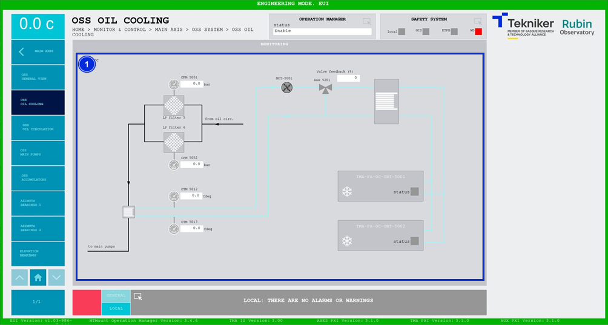

#### Pantalla OSS Oil Cooling

Esta pantalla muestra los valores del sistema de refrigeración de aceite "Oil Supply System (OSS)". Es una pantalla
únicamente de monitorización.

*Figura 2‑31. Pantalla OSS oil cooling.*

<table>
<colgroup>
<col style="width: 13<col style="width: 86</colgroup>
<thead>
<tr class="header">
<th>ITEM</th>
<th>DESCRIPCIÓN</th>
</tr>
</thead>
<tbody>
<tr class="odd">
<td>1</td>
<td>
Muestra las presiones (en bar) y las temperaturas (en Cdeg) de los elementos del sistema.

Las bombas, las válvulas y los refrigeradores se iluminan del color correspondiente a su estado:

<ul>
<li>
Gris: Si el elemento no se encuentra activo.
</li>
<li>
Verde: Si el elemento se encuentra activo.
</li>
<li>
Rojo: Si el elemento se encuentra en fallo.
</li>
</ul></td>
</tr>
</tbody>
</table>

