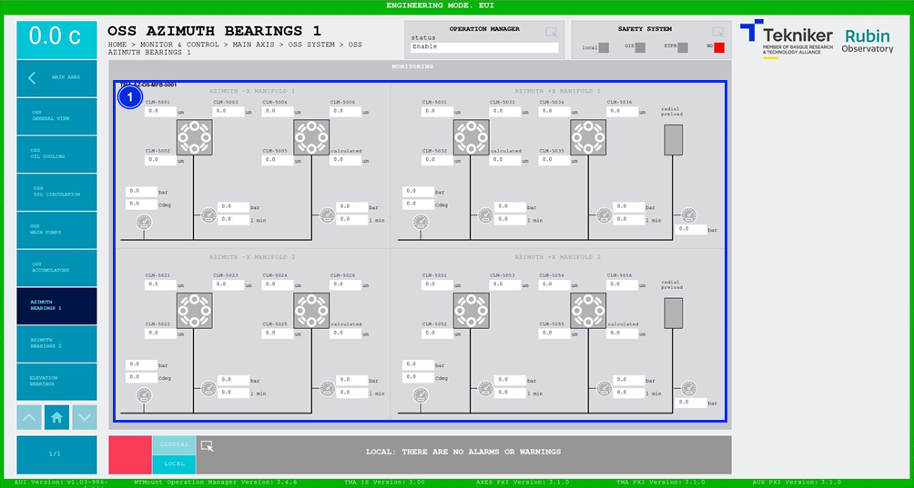

#### Pantalla Azimuth Bearings 1

Esta pantalla muestra los valores del primer grupo de cojinetes de azimuth de "Oil Supply System (OSS)". Es una pantalla
únicamente de monitorización.

*Figura 2‑35. Pantalla azimuth bearings 1.*

| ITEM | DESCRIPCIÓN                                                                                                        |
|------|--------------------------------------------------------------------------------------------------------------------|
| 1    | Muestra las presiones (en bar), los caudales (en l min) y las temperaturas (en Cdeg) de los elementos del sistema. |
