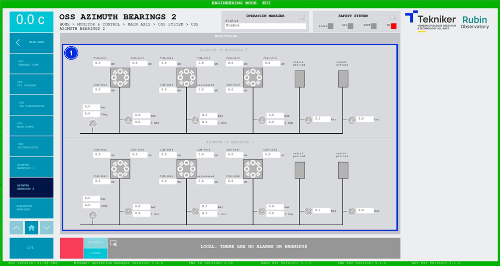

#### Pantalla OSS Azimuth Bearings 2

Esta pantalla muestra los valores del segundo grupo de cojinetes de azimuth de "Oil Supply System (OSS)". Es una
pantalla únicamente de monitorización.

*Figura 2‑36. Pantalla azimuth bearings 2.*

| ITEM | DESCRIPCIÓN                                                                                                        |
|-----------------|-------------------------------------------------------------------------------------------------------|
| 1    | Muestra las presiones (en bar), los caudales (en l min) y las temperaturas (en Cdeg) de los elementos del sistema. |
