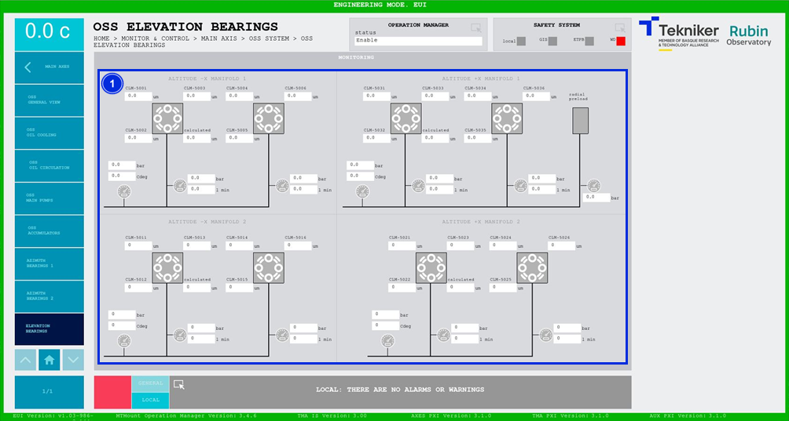

#### Pantalla OSS Elevation Bearings

Esta pantalla muestra los valores de los cojinetes de elevación de "Oil Supply System (OSS)". Es una pantalla únicamente
de monitorización.

*Figura 2‑37. Pantalla OSS elevation bearings.*

| ITEM | DESCRIPCIÓN                                                                                                        |
|-----------------|-------------------------------------------------------------------------------------------------------|
| 1    | Muestra las presiones (en bar), los caudales (en l min) y las temperaturas (en Cdeg) de los elementos del sistema. |
