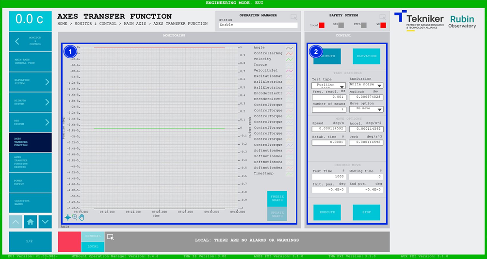

#### Pantalla Axis Transfer Function

Esta pantalla permite excitar el eje seleccionado, Azimuth o Elevación, para así poder sacar la función de transferencia
de este y posteriormente ajustar el controlador correspondiente.

| AVISO |  AVISO                                               |
|-------|------------------------------------------------------|
| {wight=1%}| **USAR SÓLO POR PERSONAL CUALIFICADO PARA ESTE ENSAYO.**|

*Figura 2‑38. Pantalla axis transfer function.*

<table>
<colgroup>
<col style="width: 13<col style="width: 86</colgroup>
<thead>
<tr class="header">
<th>ITEM</th>
<th>DESCRIPCIÓN</th>
</tr>
</thead>
<tbody>
<tr class="odd">
<td>1</td>
<td>
Muestra un gráfico con los valores relativos al controlador del telescopio en tiempo real.

Softkey “FREEZE GRAPH”: Permite congelar el gráfico.

Softkey “UPDATE GRAPH”: Permite actualizar el gráfico, tras haber sido congelado.
</td>
</tr>
<tr class="even">
<td>2</td>
<td>
Softkey “AZIMUTH”: Permite seleccionar los parámetros de azimuth. El ensayo se realizará sobre el eje de
azimuth.

Softkey “ELEVATION”: Permite seleccionar los parámetros de elevación. El ensayo se realizará sobre el eje de
elevación.

Ventanas desplegables para elegir tipo de test, excitación y opción de movimiento.

Permite introducir de manera manual los valores de resolución de frecuencia (en Hz), amplitud (en deg) y número de
medias.

Permite introducir de manera manual los valores de velocidad (en deg/s), aceleración (en deg/s2), tiempo
de estabilización (s) y jerk (deg/s3), cuando se selecciona un movimiento para el test.

Muestra los valores calculados a partir de los valores especificados en los controles superiores. Estos son: el
tiempo de test (en s), el tiempo de movimiento (en s), la posición inicial (en deg) y la posición final (en deg).

Softkey “EXECUTE”: Permite ejecutar el ensayo definido en los parámetros, excitando el eje seleccionado, Azimuth o
Elevación, y muestra en el gráfico los valores en tiempo real.

Softkey “STOP”: Permite detener el ensayo.
</td>
</tr>
</tbody>
</table>

