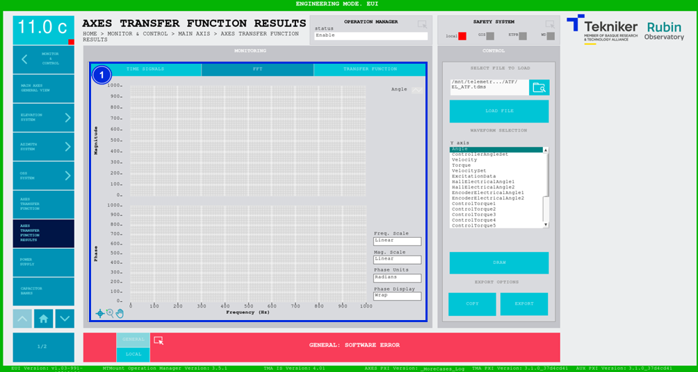
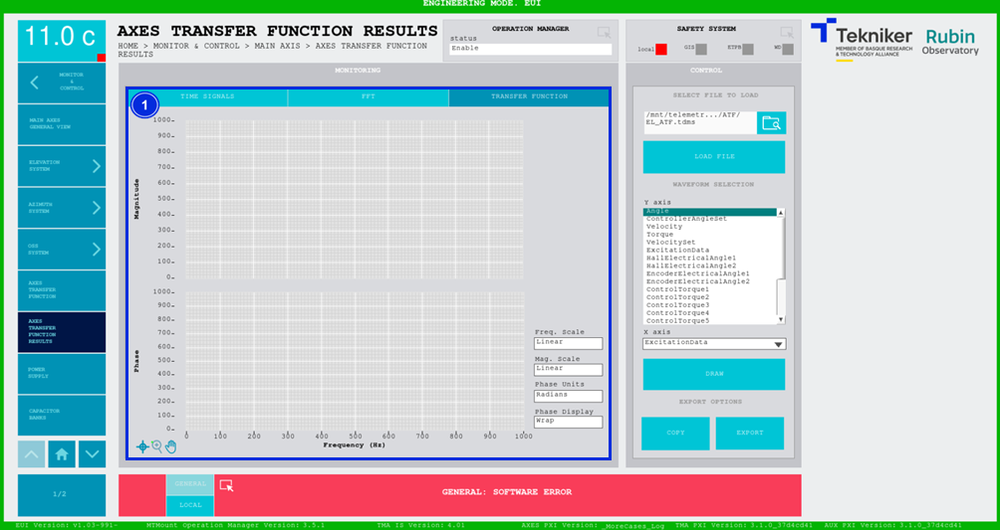

#### Pantalla Axis Transfer Function Results

Esta pantalla muestra las señales capturadas mediante la pantalla ["Axis Transfer Function"](./016_PantallaAxisTransferFunction.md)
Permite analizar los resultados para poder obtener la función de transferencia de los ejes de Azimuth y Elevación.

##### Pantalla Axis Transfer Function Results -- Time Signals

En este caso, permite ver las características del ensayo, y la captura de datos enfrentada al tiempo.

*Figura 2‑39. Pantalla axis transfer function - time signals.*

<table>
<colgroup>
<col style="width: 13<col style="width: 86</colgroup>
<thead>
<tr class="header">
<th>ITEM</th>
<th>DESCRIPCIÓN</th>
</tr>
</thead>
<tbody>
<tr class="odd">
<td>1</td>
<td>
Muestra la configuración del ensayo cargado.

Muestra el gráfico de la señal temporal obtenida en el ensayo.
</td>
</tr>
<tr class="even">
<td>2</td>
<td>
Permite seleccionar un archivo para visualizarlo en el gráfico.

Softkey “LOAD FILE”: Permite cargar el archivo seleccionado.

Permite seleccionar una o varias señales para representarlas en el eje Y del gráfico.

Softkey “DRAW”: Permite graficar las señales seleccionadas del archivo.

Softkey “COPY”: Permite copiar los datos del gráfico.

Softkey “EXPORT”: Permite exportar los datos del gráfico.
</td>
</tr>
</tbody>
</table>

##### Pantalla Axis Transfer Function Results -- FFT

Esta pantalla muestra un gráfico de la FFT de las señales previamente seleccionadas. El resultado se representa en dos
gráficos separados de magnitud y fase frente al tiempo.

*Figura 2‑40. Pantalla axis transfer function - FFT.*

<table>
<colgroup>
<col style="width: 13<col style="width: 86</colgroup>
<thead>
<tr class="header">
<th>ITEM</th>
<th>DESCRIPCIÓN</th>
</tr>
</thead>
<tbody>
<tr class="odd">
<td>1</td>
<td>
Muestra los gráficos de magnitud y fase frente a la frecuencia (en Hz).

Permite cambiar la escala de la frecuencia entre linear y logarítmica.

Permite cambiar la escala de la magnitud entre linear y decibélica.

Permite cambiar las unidades de la fase entre grados sexagesimales y radianes.

Permite hacer “Wrap” o “Unwrap”, es decir, representar la fase en valores de 0 a 360 (wrap) o no (unwrap).
</td>
</tr>
</tbody>
</table>

##### Pantalla Axis Transfer Function Results -- Transfer Function

Esta pantalla muestra un gráfico de la función de transferencia de las señales previamente seleccionadas. Se debe
seleccionar una señal en el eje Y, y otra en el eje X. El resultado se representa en dos gráficos separados de magnitud
y fase frente al tiempo.

*Figura 2‑41. Pantalla axis transfer function - transfer function.*

<table>
<colgroup>
<col style="width: 13<col style="width: 86</colgroup>
<thead>
<tr class="header">
<th>ITEM</th>
<th>DESCRIPCIÓN</th>
</tr>
</thead>
<tbody>
<tr class="odd">
<td>1</td>
<td>
Muestra los gráficos de magnitud y fase frente a la frecuencia (en Hz).

Permite cambiar la escala de la frecuencia entre linear y logarítmica.

Permite cambiar la escala de la magnitud entre linear y decibélica.

Permite cambiar las unidades de la fase entre grados sexagesimales y radianes.

Permite hacer “Wrap” o “Unwrap” de la fase.
</td>
</tr>
</tbody>
</table>
