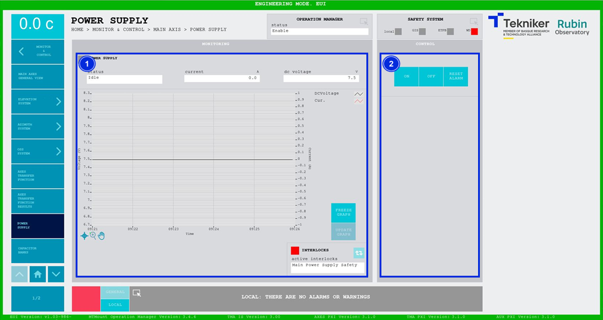

#### Pantalla Power Supply

Esta pantalla muestra y permite controlar la fuente de alimentación, la encargada de cargar el banco de condensadores
para los motores de Azimuth y Elevación.

*Figura 2‑42. Pantalla power supply.*

<table>
<colgroup>
<col style="width: 13<col style="width: 86</colgroup>
<thead>
<tr class="header">
<th>ITEM</th>
<th>DESCRIPCIÓN</th>
</tr>
</thead>
<tbody>
<tr class="odd">
<td>1</td>
<td>
Muestra el estado, la corriente (en amperios) y el voltaje (en voltios) de la fuente de alimentación. Los valores
mostrados representan el voltaje y la corriente de la parte de continua de la fuente.

Muestra el gráfico de voltaje y corriente enfrentado al tiempo.

Softkey “FREEZE GRAPH”: Permite congelar el gráfico.

Softkey “UPDATE GRAPH”: Permite actualizar el gráfico, tras haber sido congelado.

Softkey azul permite navegar entre los interlocks que se encuentran activos, en caso de haber más de uno.

Al haber algún interlock activo, el recuadro superior se visualiza de color rojo. Si no hay interlocks activos, el
recuadro se visualizará en verde y no se podrá pulsar el softkey azul.
</td>
</tr>
<tr class="even">
<td>2</td>
<td>
Softkey “ON”: Permite encender la fuente, solamente si está en “Idle” y no hay ningún interlock activo.

Softkey “OFF”: Permite apagar la fuente.

Softkey “RESET ALARM”: Permite resetear el sistema del estado de alarma en el que se encuentra o resetear el
interlock en caso de haberlo.
</td>
</tr>
</tbody>
</table>
