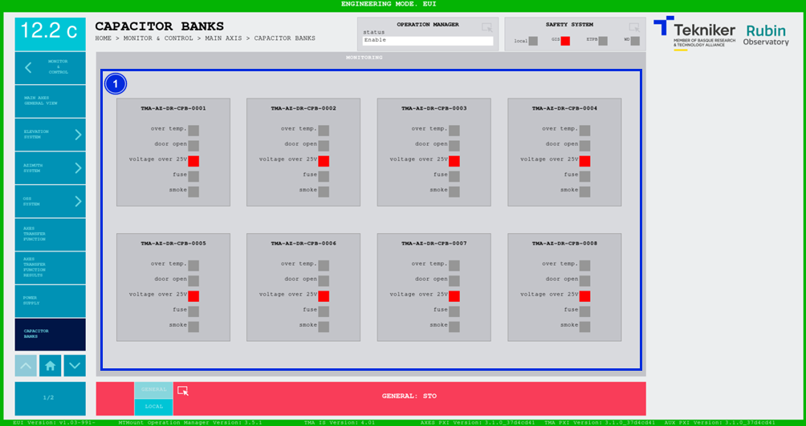

#### Pantalla Capacitor Banks

Esta pantalla muestra el estado de los armarios del banco de condensadores.

*Figura 2‑43. Pantalla capacitor banks.*

<table>
<colgroup>
<col style="width: 13<col style="width: 86</colgroup>
<thead>
<tr class="header">
<th>ITEM</th>
<th>DESCRIPCIÓN</th>
</tr>
</thead>
<tbody>
<tr class="odd">
<td>1</td>
<td>
Muestra los estados de los armarios del banco de condensadores. Se mantienen en gris hasta que son activados, una
vez activados pasan a color rojo:

<ul>
<li>
“Over temp.”, cuando hay una temperatura excesivamente alta en la cabina.
</li>
<li>
“Door open”, cuando la puerta se encuentra abierta.
</li>
<li>
“Voltage over 25 V”, cuando el voltaje es superior a 25 V.
</li>
<li>
“Fuse”, cuando falla un fusible.
</li>
<li>
“Smoke”, cuando se detecta humo dentro de la cabina.
</li>
</ul></td>
</tr>
</tbody>
</table>
