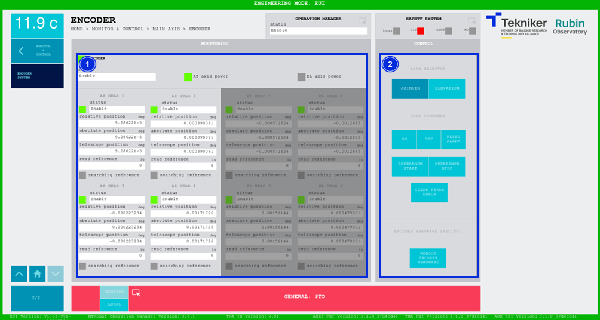

#### Pantalla Encoder System

Esta pantalla muestra y permite controlar los estados de los elementos del sistema de encoder para los ejes principales,
Azimuth y Elevación.

*Figura 2‑44. Pantalla encoder system.*

<table>
<colgroup>
<col style="width: 13<col style="width: 86</colgroup>
<thead>
<tr class="header">
<th>ITEM</th>
<th>DESCRIPCIÓN</th>
</tr>
</thead>
<tbody>
<tr class="odd">
<td>1</td>
<td>
Muestra el estado del encoder y de cada una de las cabezas de azimuth y de elevación.

Por cada cabeza muestra: La posición relativa (en deg), la posición absoluta (en deg), la posición del telescopio (en
deg) y el valor de referencia (en cuentas del sistema de encoder, es un valor para usuarios avanzados que conozcan el
sistema de encoder).

Cada cabeza posee un led en “Searching reference” que se ilumina de color verde al pulsar el softkey “REFERENCE
START”. De no encontrarse la referencia o de pulsar el softkey “REFERENCE STOP”, después de un tiempo determinado, el
sistema entrará en estado de “Fault”.

Vuelve al color gris automáticamente tras acabar la búsqueda o al pulsar el softkey “REFERENCE STOP”.
</td>
</tr>
<tr class="even">
<td>2</td>
<td>
Softkey “AZIMUTH”: Permite seleccionar las cabezas de azimuth.

Softkey “ELEVATION”: Permite seleccionar las cabezas de elevación.

Softkey “ON”: Permite encender el sistema de encoder, solamente si no hay ningún interlock activo.

Softkey “OFF”: Permite apagar el sistema de encoder.

Softkey “RESET ALARM”: Permite resetear el sistema del estado de alarma en el que se encuentra o resetear el
interlock en caso de haberlo.

Softkey “REFERENCE START”: Permite iniciar la búsqueda de referencia.

Softkey “REFERENCE STOP”: Permite parar la búsqueda de referencia.

Softkey “CLEAR HEADS ERROR”: Permite eliminar los errores de las cabezas.

Softkey “REBOOT ENCODER HARDWARE”: Permite reiniciar el hardware del encoder (EIB).

<table>
<colgroup>
<col style="width: 10<col style="width: 89</colgroup>
<tbody>
<tr class="odd">
<td>🛑</td>
<td><b>Realizar esta operación sólo por personal instruido.</b></td>
</tr>
</tbody>
</table></td>
</tr>
</tbody>
</table>
