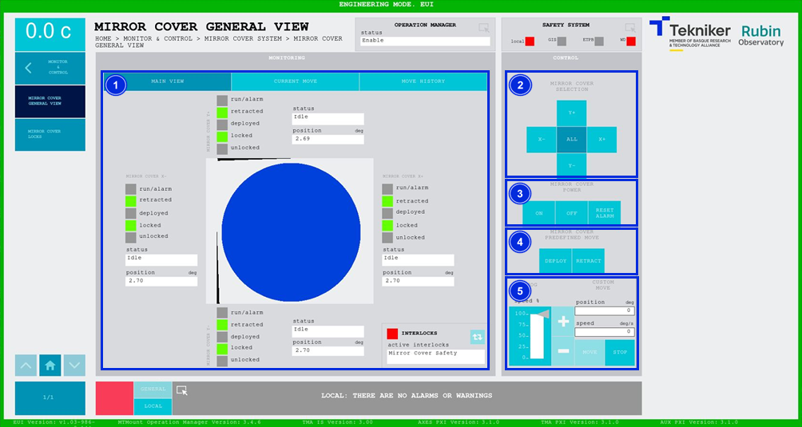
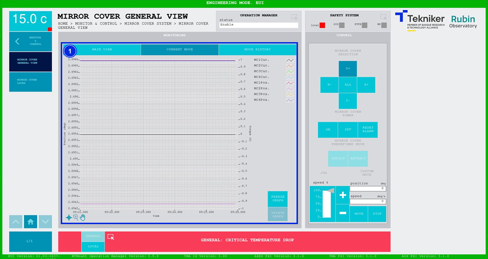
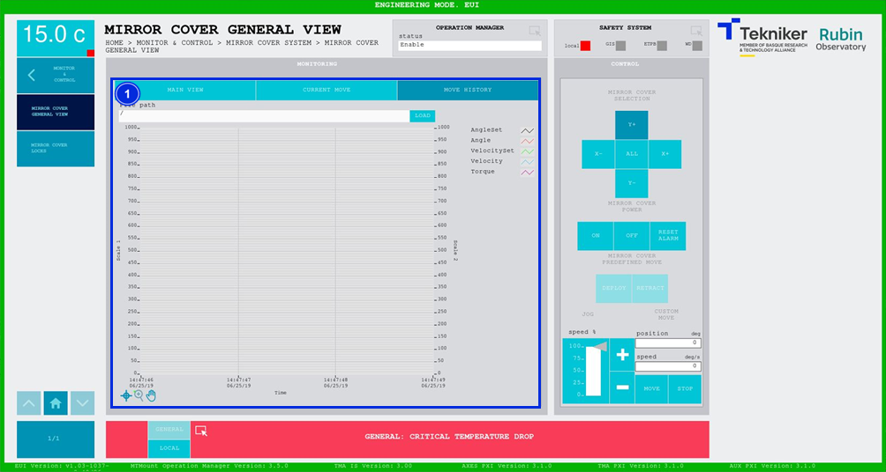

#### Pantalla Mirror Cover General View

##### Pantalla Mirror Cover General View -- Main View

Esta pantalla muestra y permite controlar los estados y movimientos de los "Mirror Cover".

*Figura 2‑45. Pantalla mirror cover general view - main view.*

<table>
<colgroup>
<col style="width: 13<col style="width: 86</colgroup>
<thead>
<tr class="header">
<th>ITEM</th>
<th>DESCRIPCIÓN</th>
</tr>
</thead>
<tbody>
<tr class="odd">
<td>1</td>
<td>
Muestra el estado y la posición (en deg) de los “Mirror Cover”.

El recuadro junto a “run/alarm” se ilumina con el color correspondiente al estado del “Mirror Cover”.

Muestra si los “Mirror Cover” se encuentran recogidos, desplegados, bloqueados o desbloqueados. Iluminando de color
verde la opción correspondiente.

Softkey azul permite navegar entre los interlocks que se encuentran activos, en caso de haber más de uno.

Al haber algún interlock activo, el recuadro superior se visualiza de color rojo. Si no hay interlocks activos, el
recuadro se visualizará en verde y no se podrá pulsar el softkey azul.
</td>
</tr>
<tr class="even">
<td>2</td>
<td>
Softkeys “Y+”, “X+”, “Y-” y “X-”: Permiten seleccionar el “Mirror Cover” deseado.

Softkey “ALL”: Permite seleccionar los cuatro “Mirror Cover” al mismo tiempo.
</td>
</tr>
<tr class="odd">
<td>3</td>
<td>
Softkey “ON”: Permite encender el “Mirror Cover” seleccionado o todos en caso de seleccionar “ALL”, solamente si
está en “Idle” y no hay ningún interlock activo.

Softkey “OFF”: Permite apagar el sistema.

Softkey “RESET ALARM”: Permite resetear el sistema del estado de alarma en el que se encuentra o resetear el
interlock en caso de haberlo.
</td>
</tr>
<tr class="even">
<td>4</td>
<td>
Solamente disponible al seleccionar todos los ejes, softkey “ALL”.

Softkey “DEPLOY”: Permite desplegar todos los “Mirror Cover”.

Softkey “RETRACT”: Permite recoger todos los “Mirror Cover”.
</td>
</tr>
<tr class="odd">
<td>5</td>
<td>
Permite ajustar la posición (en deg) y la velocidad (en deg/s) de los “Mirror Cover”. Esto solo es posible cuando
se controlan de forma individual.

Softkeys “+” o “-”: Permiten hacer un movimiento a velocidad constante en dirección positiva o negativa
respectivamente. De esta manera, se ajusta el porcentaje de la velocidad por defecto definida en los parámetros con el
slider vertical.

Softkey “MOVE”: Permite realizar el movimiento de los ejes con las especificaciones previamente introducidas.

Softkey “STOP”: Permite detener el movimiento de los ejes.
</td>
</tr>
</tbody>
</table>

##### Pantalla Mirror Cover General View -- Current Move

Esta pantalla muestra un gráfico con el movimiento de los "Mirror Cover" en tiempo real.

*Figura 2‑46. Pantalla mirror cover general view - current move.*

<table>
<colgroup>
<col style="width: 13<col style="width: 86</colgroup>
<thead>
<tr class="header">
<th>ITEM</th>
<th>DESCRIPCIÓN</th>
</tr>
</thead>
<tbody>
<tr class="odd">
<td>1</td>
<td>
Muestra el gráfico del movimiento de los “Mirror Cover” en tiempo real.

Softkey “FREEZE GRAPH”: Permite congelar el gráfico.

Softkey “UPDATE GRAPH”: Permite actualizar el gráfico, tras haber sido congelado.
</td>
</tr>
</tbody>
</table>

##### Pantalla Mirror Cover General View -- Move History

Esta pantalla muestra y permite cargar los últimos cinco movimientos de los "Mirror Cover", siendo el número 1 el
último.

*Figura 2‑47. Pantalla mirror cover general view - move history.*

<table>
<colgroup>
<col style="width: 13<col style="width: 86</colgroup>
<thead>
<tr class="header">
<th>ITEM</th>
<th>DESCRIPCIÓN</th>
</tr>
</thead>
<tbody>
<tr class="odd">
<td>1</td>
<td>
Softkey “LOAD”: Permite cargar los últimos cinco movimientos.

Tras seleccionar el movimiento deseado, permite visualizarlo en el gráfico.
</td>
</tr>
</tbody>
</table>
