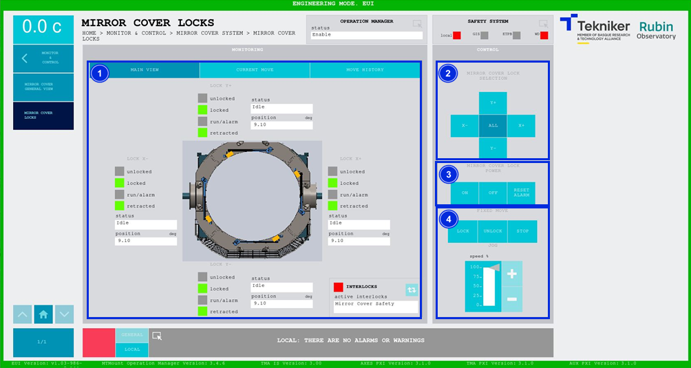
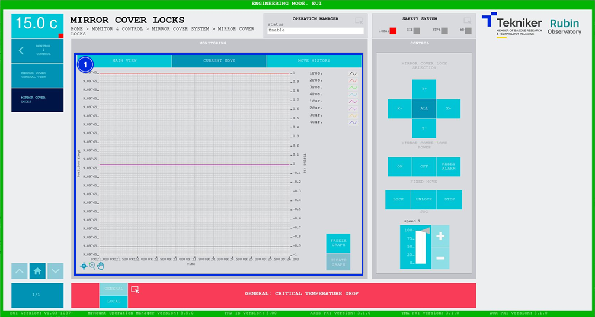
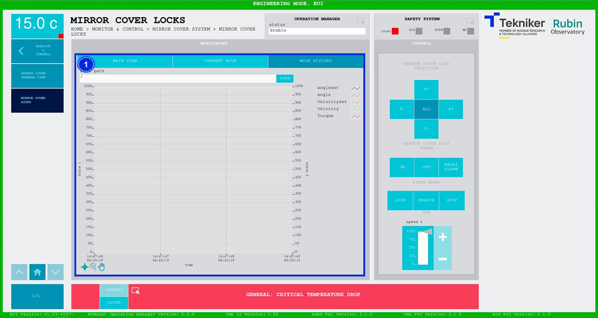

#### Pantalla Mirror Cover Locks

##### Pantalla Mirror Cover Locks -- Main View

Esta pantalla muestra y permite controlar los estados y movimientos de los bloqueos o "Mirror Cover Locks".

*Figura 2‑48. Pantalla mirror cover locks - main view.*

<table>
<colgroup>
<col style="width: 13<col style="width: 86</colgroup>
<thead>
<tr class="header">
<th>ITEM</th>
<th>DESCRIPCIÓN</th>
</tr>
</thead>
<tbody>
<tr class="odd">
<td>1</td>
<td>
Muestra el estado y la posición (en deg) de los “Mirror Cover Locks”.

El recuadro junto a “run/alarm” se ilumina con el color correspondiente al estado del bloqueo.

Muestra si los “Mirror Cover” se encuentran recogidos, bloqueados o desbloqueados. Iluminando de color verde la
opción correspondiente.

Muestra el estado de cada bloqueo en la figura:

<ul>
<li>
Naranja: Significa que el bloqueo está bloqueando el “Mirror Cover”.
</li>
<li>
Rojo: Significa que el bloqueo se encuentra en una posición que interfiere con el correcto movimiento del “Mirror
Cover”.
</li>
<li>
Verde: Significa que el bloqueo está abierto del todo, y permite el movimiento del “Mirror Cover”.
</li>
</ul>

Softkey azul permite navegar entre los interlocks que se encuentran activos, en caso de haber más de uno.

Al haber algún interlock activo, el recuadro superior se visualiza de color rojo. Si no hay interlocks activos, el
recuadro se visualizará en verde y no se podrá pulsar el softkey azul.
</td>
</tr>
<tr class="even">
<td>2</td>
<td>
Softkeys “Y+”, “X+”, “Y-” y “X-”: Permiten seleccionar el “Mirror Cover” deseado.

Softkey “ALL”: Permite seleccionar los cuatro “Mirror Cover” al mismo tiempo.
</td>
</tr>
<tr class="odd">
<td>3</td>
<td>
Softkey “ON”: Permite encender el sistema, solamente si está en “Idle” y no hay ningún interlock activo.

Softkey “OFF”: Permite apagar el sistema.

Softkey “RESET ALARM”: Permite resetear el sistema del estado de alarma en el que se encuentra o resetear el
interlock en caso de haberlo.
</td>
</tr>
<tr class="even">
<td>4</td>
<td>
Softkey “LOCK”: Permite bloquear el “Mirror Cover”.

Softkey “UNLOCK”: Permite desbloquear el “Mirror Cover”.

Softkey “STOP”: Permite detener el movimiento.

Softkeys “+” o “-”: Permiten hacer un movimiento a velocidad constante en dirección positiva o negativa
respectivamente. De esta manera, se ajusta el porcentaje de la velocidad por defecto definida en los parámetros con el
slider vertical.
</td>
</tr>
</tbody>
</table>

##### Pantalla Mirror Cover Locks -- Current Move

Esta pantalla muestra un gráfico con el movimiento de los "Mirror Cover Locks" en tiempo real.

*Figura 2‑49. Pantalla mirror cover locks - current move.*

<table>
<colgroup>
<col style="width: 13<col style="width: 86</colgroup>
<thead>
<tr class="header">
<th>ITEM</th>
<th>DESCRIPCIÓN</th>
</tr>
</thead>
<tbody>
<tr class="odd">
<td>1</td>
<td>
Muestra el gráfico del movimiento de los “Mirror Cover Locks” en tiempo real.

Softkey “FREEZE GRAPH”: Permite congelar el gráfico.

Softkey “UPDATE GRAPH”: Permite actualizar el gráfico, tras haber sido congelado.
</td>
</tr>
</tbody>
</table>

##### Pantalla Mirror Cover Locks -- Move History

Esta pantalla muestra y permite cargar los últimos cinco movimientos de los "Mirror Cover Locks", siendo el número 1 el
último.

*Figura 2‑50. Pantalla mirror cover locks - move history.*

<table>
<colgroup>
<col style="width: 13<col style="width: 86</colgroup>
<thead>
<tr class="header">
<th>ITEM</th>
<th>DESCRIPCIÓN</th>
</tr>
</thead>
<tbody>
<tr class="odd">
<td>1</td>
<td>
Softkey “LOAD”: Permite cargar los últimos cinco movimientos.

Tras seleccionar el movimiento deseado, permite visualizarlo en el gráfico.
</td>
</tr>
</tbody>
</table>
