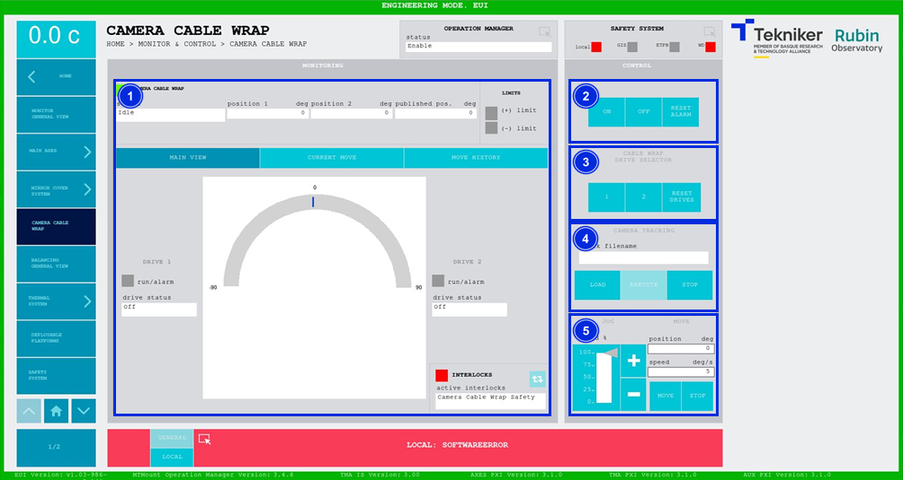

#### Pantalla Camera Cable Wrap

##### Pantalla Camera Cable Wrap -- Main View

Esta pantalla muestra y permite controlar los estados y movimientos de los motores de "Camera Cable Wrap".

| AVISO      | AVISO                                                                                                      |
|------------|------------------------------------------------------------------------------------------------------------|
| {wigth=5%}| **NO UTILIZAR ESTE ELEMENTO SI LA CÁMARA SE ENCUENTRA CONECTADA, SALVO POR PERSONAL FORMADO EN EL ROTADOR Y ROTADOR DE CABLES DE LA CÁMARA.**|

*Figura 2‑51. Pantalla camera cable wrap - main view.*

<table>
<colgroup>
<col style="width: 13<col style="width: 86</colgroup>
<thead>
<tr class="header">
<th>ITEM</th>
<th>DESCRIPCIÓN</th>
</tr>
</thead>
<tbody>
<tr class="odd">
<td>1</td>
<td>
Muestra el estado, la posición 1 (en deg), la posición 2 (en deg) y la posición publicada (en deg) de “Camera
Cable Wrap”.

Muestra el estado de los límites de recorrido. Se ilumina de color verde el recuadro correspondiente al límite que se
activa.

Muestra el estado de los motores. El recuadro junto a “run/alarm” se ilumina con el color correspondiente al estado
del motor.

Softkey azul permite navegar entre los interlocks que se encuentran activos, en caso de haber más de uno.

Al haber algún interlock activo, el recuadro superior se visualiza de color rojo. Si no hay interlocks activos, el
recuadro se visualizará en verde y no se podrá pulsar el softkey azul.
</td>
</tr>
<tr class="even">
<td>2</td>
<td>
Softkey “ON”: Permite encender el sistema, solamente si está en “Idle” y no hay ningún interlock activo.

Softkey “OFF”: Permite apagar el sistema.

Softkey “RESET ALARM”: Permite resetear el sistema del estado de alarma en el que se encuentra o resetear el
interlock en caso de haberlo.
</td>
</tr>
<tr class="odd">
<td>3</td>
<td>
Softkeys “1” y “2”: Permiten seleccionar el motor deseado.

Softkey “RESET DRIVES”: Permite resetear los motores.
</td>
</tr>
<tr class="even">
<td>4</td>
<td>Permite comandar una trayectoria fijada por medio de un archivo, [ver](./001_PantallaMainAxisGeneralView.md/#pantalla-tracking)</td>
</tr>
<tr class="odd">
<td>5</td>
<td>
Permite ajustar la posición (en deg) y la velocidad (en deg/s) del “Camera Cable Wrap”.

Softkeys “+” o “-”: Permiten hacer un movimiento a velocidad constante en dirección positiva o negativa
respectivamente. De esta manera, se ajusta el porcentaje de la velocidad por defecto definida en los parámetros con el
slider vertical.

Softkey “MOVE”: Permite realizar el movimiento de los ejes con las especificaciones previamente introducidas.

Softkey “STOP”: Permite detener el movimiento de los ejes.
</td>
</tr>
</tbody>
</table>

##### Pantalla Camera Cable Wrap -- Current Move

Esta pantalla muestra un gráfico con el movimiento de "Camera Cable Wrap" en tiempo real.

*Figura 2‑52. Pantalla camera cable wrap - current move.*

<table>
<colgroup>
<col style="width: 13<col style="width: 86</colgroup>
<thead>
<tr class="header">
<th>ITEM</th>
<th>DESCRIPCIÓN</th>
</tr>
</thead>
<tbody>
<tr class="odd">
<td>1</td>
<td>
Muestra el gráfico del movimiento de “Camera Cable Wrap” en tiempo real.

Softkey “FREEZE GRAPH”: Permite congelar el gráfico.

Softkey “UPDATE GRAPH”: Permite actualizar el gráfico, tras haber sido congelado.
</td>
</tr>
</tbody>
</table>

##### Pantalla Camera Cable Wrap -- Move History

Esta pantalla muestra y permite cargar los últimos cinco movimientos de "Camera Cable Wrap", siendo el número 1 el
último.

*Figura 2‑53. Pantalla camera cable wrap - move history.*

<table>
<colgroup>
<col style="width: 13<col style="width: 86</colgroup>
<thead>
<tr class="header">
<th>ITEM</th>
<th>DESCRIPCIÓN</th>
</tr>
</thead>
<tbody>
<tr class="odd">
<td>1</td>
<td>
Softkey “LOAD”: Permite cargar los últimos cinco movimientos.

Tras seleccionar el movimiento deseado, permite visualizarlo en el gráfico.
</td>
</tr>
</tbody>
</table>
