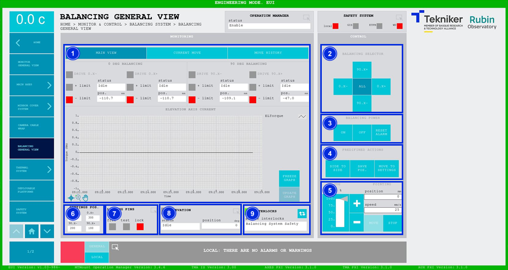
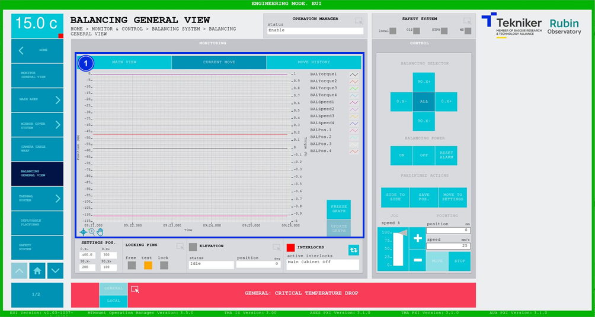
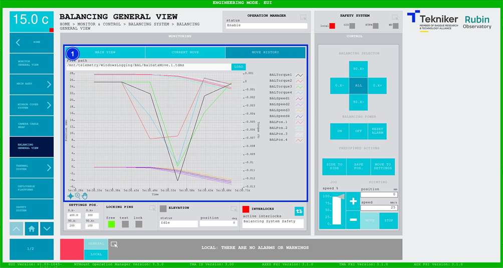

#### Pantalla Balancing General View

##### Pantalla Balancing General View -- Main View

Esta pantalla muestra y permite controlar los estados y movimientos de los motores que desplazan las masas encargadas
del equilibrado fino del eje de elevación.

*Figura 2‑54. Pantalla balancing general view - main view.*

<table>
<colgroup>
<col style="width: 13<col style="width: 86</colgroup>
<thead>
<tr class="header">
<th>ITEM</th>
<th>DESCRIPCIÓN</th>
</tr>
</thead>
<tbody>
<tr class="odd">
<td>1</td>
<td>
Muestra el estado y la posición (en mm) de los motores. El recuadro junto a cada motor se ilumina con el color
correspondiente al estado del mismo.

Muestra el estado de los límites de cada motor. Se ilumina de color rojo el recuadro correspondiente al límite que se
activa.

Muestra el gráfico con el par del eje de elevación en tiempo real.

Softkey “FREEZE GRAPH”: Permite congelar el gráfico.

Softkey “UPDATE GRAPH”: Permite actualizar el gráfico, tras haber sido congelado.
</td>
</tr>
<tr class="even">
<td>2</td>
<td>
Softkeys “90 X+”, “0 X+”, “90 X-” y “0 X-“: Permiten seleccionar la masa de equilibrado.

Softkey “ALL”: Permite seleccionar las cuatro masas de equilibrado.
</td>
</tr>
<tr class="odd">
<td>3</td>
<td>
Softkey “ON”: Permite encender la masa de equilibrio seleccionada, o todas dependiendo de la selección.

Softkey “OFF”: Permite apagar la masa de equilibrio seleccionada, o todas dependiendo de la selección.

Softkey “RESET ALARM”: Permite resetear la masa de equilibrio seleccionada, o todas dependiendo de la selección y
resetear el interlock en caso de haberlo.
</td>
</tr>
<tr class="even">
<td>4</td>
<td>
Solamente disponible al seleccionar todos los ejes al mismo tiempo.

Softkey “SIDE TO SIDE”: Permite mover todas las masas de extremo a extremo regresando al punto de partida. Se mueven
todas las masas de una en una.

Softkey “SAVE POS.”: Permite guardar las posiciones actuales en la base de datos.

Softkey “MOVE TO SETTINGS”: Permite regresar a las posiciones guardadas en la base de datos, estos valores aparecen
en el item 6 de esta misma tabla.
</td>
</tr>
<tr class="odd">
<td>5</td>
<td>
Permite ajustar la posición (en deg) y la velocidad (en deg/s) del motor encargado del equilibrio, siempre de
manera individual.

Softkeys “+” o “-”: Permiten hacer un movimiento a velocidad constante en dirección positiva o negativa
respectivamente. De esta manera, se ajusta el porcentaje de la velocidad por defecto definida en los parámetros con el
slider vertical.

Softkey “MOVE”: Permite realizar el movimiento de los ejes con las especificaciones previamente introducidas.

Softkey “STOP”: Permite detener el movimiento de los ejes.
</td>
</tr>
<tr class="even">
<td>6</td>
<td>Muestra los valores guardados en los [“Settings”](../03_Settings/012_PantallaBalancingSettings.md).</td>
</tr>
<tr class="odd">
<td>7</td>
<td>
Permite acceder a la pantalla [“Locking Pins General View”](./004_PantallaLockingPins.md)

Muestra el estado de los pasadores, y activa el led con el color correspondiente:

<ul>
<li>
“FREE”: Significa que los pasadores se encuentran libres, y se ilumina de color verde.
</li>
<li>
“TEST”: Significa que los pasadores se encuentran en test, y se ilumina de color naranja.
</li>
<li>
“LOCK”: Significa que los pasadores se encuentran bloqueados, y se ilumina de color rojo.
</li>
</ul></td>
</tr>
<tr class="even">
<td>8</td>
<td>
Muestra el estado y la posición (en deg) de “Elevation”.

Permite acceder a la pantalla [“Elevation General View”](./002_PantallaElevationGeneralView.md)
</td>
</tr>
<tr class="odd">
<td>9</td>
<td>
Softkey azul permite navegar entre los interlocks que se encuentran activos, en caso de haber más de uno.

Al haber algún interlock activo, el recuadro superior se visualiza de color rojo. Si no hay interlocks activos, el
recuadro se visualizará en verde y no se podrá pulsar el softkey azul.
</td>
</tr>
</tbody>
</table>

##### Pantalla Balancing General View -- Current Move

Esta pantalla muestra un gráfico con el movimiento de las cuatro masas encargadas de equilibrar el eje de elevación en
tiempo real.

*Figura 2‑55. Pantalla balancing general view - current move.*

<table>
<colgroup>
<col style="width: 13<col style="width: 86</colgroup>
<thead>
<tr class="header">
<th>ITEM</th>
<th>DESCRIPCIÓN</th>
</tr>
</thead>
<tbody>
<tr class="odd">
<td>1</td>
<td>
Muestra el gráfico del movimiento de las cuatro masas encargadas de equilibrar el eje de elevación en tiempo
real.

Softkey “FREEZE GRAPH”: Permite congelar el gráfico.

Softkey “UPDATE GRAPH”: Permite actualizar el gráfico, tras haber sido congelado.
</td>
</tr>
</tbody>
</table>

##### Pantalla Balancing General View -- Move History

Esta pantalla muestra y permite cargar los últimos cinco movimientos de las masas encargadas de equilibrar el eje de
elevación, siendo el número 1 el último.

*Figura 2‑56. Pantalla balancing general view - move history.*

<table>
<colgroup>
<col style="width: 13<col style="width: 86</colgroup>
<thead>
<tr class="header">
<th>ITEM</th>
<th>DESCRIPCIÓN</th>
</tr>
</thead>
<tbody>
<tr class="odd">
<td>1</td>
<td>
Softkey “LOAD”: Permite cargar los últimos cinco movimientos.

Tras seleccionar el movimiento deseado, permite visualizarlo en el gráfico.
</td>
</tr>
</tbody>
</table>
