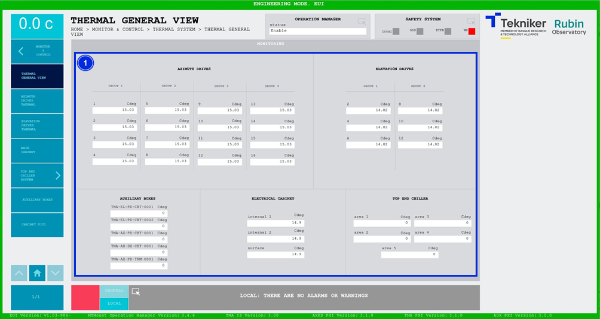

#### Pantalla Thermal General View

Esta pantalla muestra las temperaturas de los diferentes elementos que se visualizarán en los siguientes apartados. Es
una pantalla únicamente de monitorización.

*Figura 2‑57. Pantalla thermal general view.*

| ITEM | DESCRIPCIÓN                                                             |
|------|-------------------------------------------------------------------------|
| 1    | Muestra las temperaturas (en Cdeg) de diferentes elementos del sistema. |
