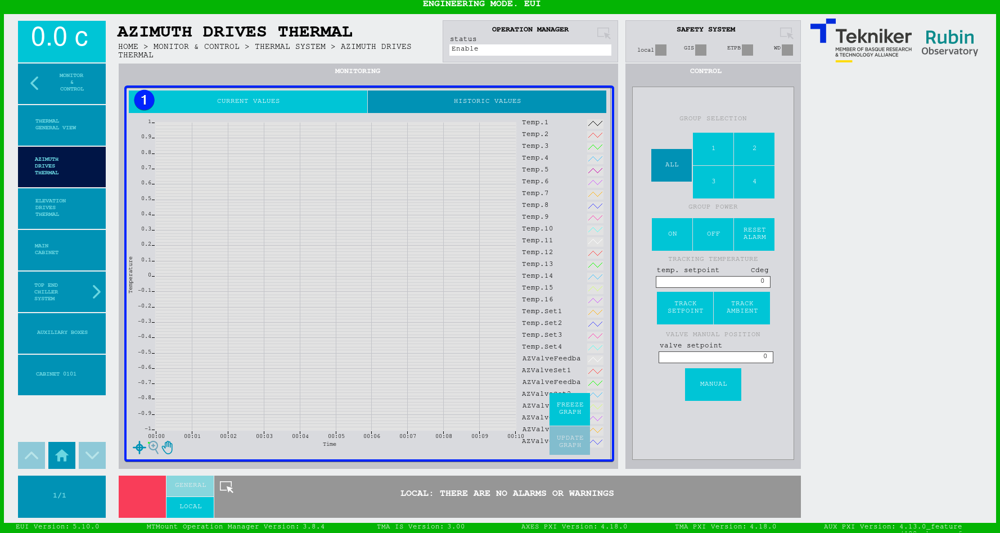

#### Pantalla Azimuth Drives Thermal

##### Pantalla Azimuth Thermal -- Current Values

Esta pantalla muestra y permite controlar las temperaturas de los motores de azimuth.

*Figura 2‑58. Pantalla azimuth drives thermal - current values.*

<table>
<colgroup>
<col style="width: 13<col style="width: 86</colgroup>
<thead>
<tr class="header">
<th>ITEM</th>
<th>DESCRIPCIÓN</th>
</tr>
</thead>
<tbody>
<tr class="odd">
<td>1</td>
<td>
Muestra el estado, el setpoint (en Cdeg) y las temperaturas (en Cdeg) en los motores azimuth.

Softkey azul permite navegar entre los interlocks que se encuentran activos, en caso de haber más de uno.

Al haber algún interlock activo, el recuadro superior se visualiza de color rojo. Si no hay interlocks activos, el
recuadro se visualizará en verde y no se podrá pulsar el softkey azul.
</td>
</tr>
<tr class="even">
<td>2</td>
<td>
Softkey “ALL”: Permite seleccionar todos los grupos de motores.

Softkeys “1”, “2”, “3” y “4”: Permiten seleccionar los motores deseados.
</td>
</tr>
<tr class="odd">
<td>3</td>
<td>
Softkey “ON”: Permite encender la selección para intentar llevar su temperatura a la temperatura ambiente.

Softkey “OFF”: Permite apagar la selección. La válvula pasa a tener una apertura fija guardada en los “Settings”.

Softkey “RESET ALARM”: Permite resetear el sistema del estado de alarma en el que se encuentra o resetear el
interlock en caso de haberlo.
</td>
</tr>
<tr class="even">
<td>4</td>
<td>
Softkey “TRACK SETPOINT”: Permite controlar la temperatura de manera manual utilizando el valor introducido en el
control “temp. setpoint”.

Softkey “TRACK AMBIENT”: Permite hacer que el controlador de temperatura siga a la temperatura ambiente.

Softkey “MANUAL”: Permite manejar la apertura de la válvula de manera manual utilizando el valor introducido en el
control “valve setpoint”.
</td>
</tr>
<tr class="odd">
<td>5</td>
<td>
Softkey “START”: Permite comenzar el autotune, una vez completado requiere guardar los settings calculados. Estos
se escriben como “Write” (en naranja) en la pantalla de “Settings” correspondiente.

Softkey “STOP”: Permite parar el autotune.
</td>
</tr>
</tbody>
</table>

##### Pantalla Azimuth Drives Thermal -- Historic Values

Esta pantalla muestra un gráfico con el historial de temperaturas de los motores azimuth a lo largo del tiempo.

*Figura 2‑59. Pantalla azimuth drives thermal - historic values.*

<table>
<colgroup>
<col style="width: 13<col style="width: 86</colgroup>
<thead>
<tr class="header">
<th>ITEM</th>
<th>DESCRIPCIÓN</th>
</tr>
</thead>
<tbody>
<tr class="odd">
<td>1</td>
<td>
Muestra el gráfico con el historial de temperaturas de los motores azimuth a lo largo del tiempo.

Softkey “FREEZE GRAPH”: Permite congelar el gráfico.

Softkey “UPDATE GRAPH”: Permite actualizar el gráfico, tras haber sido congelado.
</td>
</tr>
</tbody>
</table>
