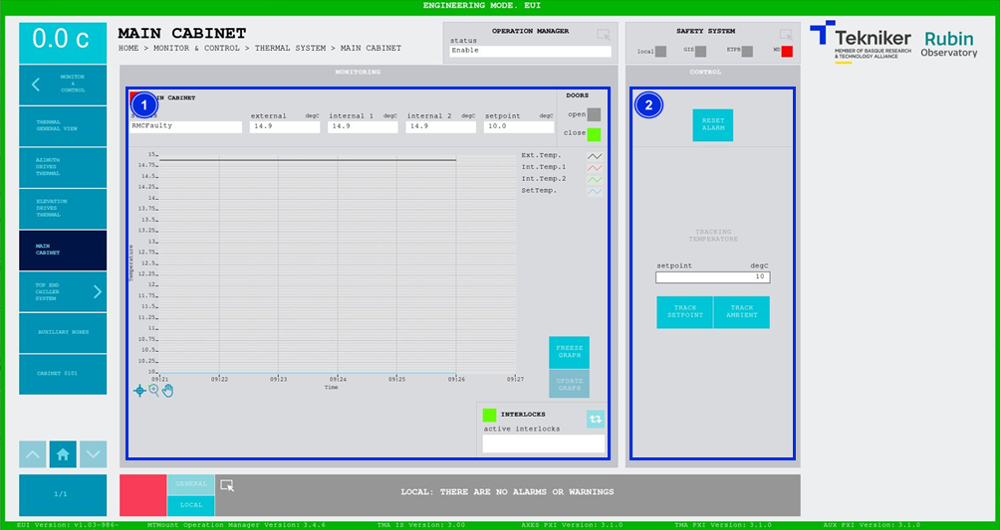

#### Pantalla Main Cabinet

Esta pantalla muestra y permite controlar la temperatura de la cabina principal del MCS, TMA-AZ-CS-CBT-0001.

*Figura 2‑62. Pantalla main cabinet.*

<table>
<colgroup>
<col style="width: 13<col style="width: 86</colgroup>
<thead>
<tr class="header">
<th>ITEM</th>
<th>DESCRIPCIÓN</th>
</tr>
</thead>
<tbody>
<tr class="odd">
<td>1</td>
<td>
Muestra el estado, la temperatura externa (en degC), la temperatura interna 1 (en degC), la temperatura interna 2
(en degC) y el setpoint (en degC) de la cabina principal.

Esta pantalla puede presentar dos estados de fallo diferentes:

<ul>
<li>
“RMCFAULTY”: Significa que el controlador de temperatura no comunica correctamente, pero el sistema es capaz de
seguir funcionando.
</li>
<li>
“SPECIAL FAULT”: La temperatura del armario está fuera de rango y se apagará el MCS completo.

Muestra si las puertas se encuentran abiertas o cerradas. Iluminando de color verde “open” en caso de estar abiertas,
o “close” en caso de estar cerradas. En caso de estar las puertas abiertas el sistema no controla la
temperatura.
</li>
</ul>

Muestra un gráfico con las temperaturas en tiempo real.

Softkey “FREEZE GRAPH”: Permite congelar el gráfico.

Softkey “UPDATE GRAPH”: Permite actualizar el gráfico, tras haber sido congelado.

Softkey azul permite navegar entre los interlocks que se encuentran activos, en caso de haber más de uno.

Al haber algún interlock activo, el recuadro superior se visualiza de color rojo. Si no hay interlocks activos, el
recuadro se visualizará en verde y no se podrá pulsar el softkey azul.
</td>
</tr>
<tr class="even">
<td>2</td>
<td>
Softkey “RESET ALARM”: Permite resetear las alarmas del controlador o resetear el interlock en caso de
haberlo.

Softkey “TRACK SETPOINT”: Permite controlar la temperatura de manera manual utilizando el valor introducido en el
control “setpoint”.

Softkey “TRACK AMBIENT”: Permite hacer que el controlador de temperatura siga a la temperatura ambiente.
</td>
</tr>
</tbody>
</table>
