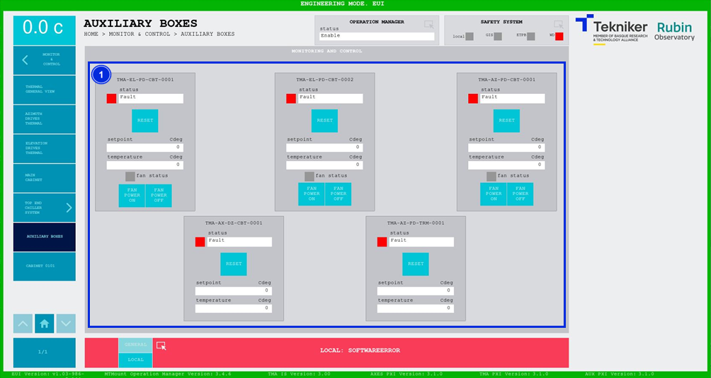

#### Pantalla Auxiliary Boxes

Esta pantalla muestra y permite ajustar los controladores de temperatura de las diferentes cabinas distribuidas por el
telescopio.

*Figura 2‑63. Pantalla auxiliary boxes.*

<table>
<colgroup>
<col style="width: 13<col style="width: 86</colgroup>
<thead>
<tr class="header">
<th>ITEM</th>
<th>DESCRIPCIÓN</th>
</tr>
</thead>
<tbody>
<tr class="odd">
<td>1</td>
<td>
Barras “status” muestran el estado del controlador correspondiente.

Softkeys “RESET”: Permiten resetear el controlador correspondiente.

Muestra el setpoint (en Cdeg) y la temperatura (en Cdeg) del controlador correspondiente.

Muestra el estado del ventilador. Se mantiene gris mientras está apagado, y se ilumina de color verde cuando se
enciende.

Softkeys “FAN POWER ON”: Permiten encender el ventilador correspondiente.

Softkeys “FAN POWER OFF”: Permiten apagar el ventilador correspondiente.
</td>
</tr>
</tbody>
</table>
