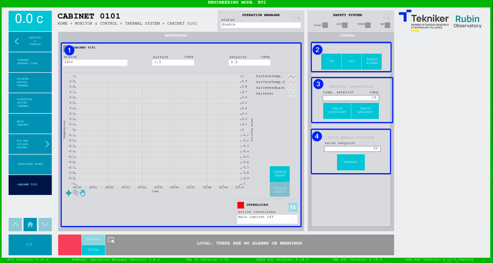

#### Pantalla Cabinet 0101

Esta pantalla muestra y permite controlar la temperatura de la cabina TMA-AZ-CS-CBT-0101.

*Figura 2‑64. Pantalla cabinet 0101.*

<table>
<colgroup>
<col style="width: 13<col style="width: 86</colgroup>
<thead>
<tr class="header">
<th>ITEM</th>
<th>DESCRIPCIÓN</th>
</tr>
</thead>
<tbody>
<tr class="odd">
<td>1</td>
<td>
Muestra el estado, la temperatura de la superficie (en Cdeg) y el setpoint (en Cdeg) de la cabina 0101.

Muestra el gráfico con las temperaturas en tiempo real.

Softkey “FREEZE GRAPH”: Permite congelar el gráfico.

Softkey “UPDATE GRAPH”: Permite actualizar el gráfico, tras haber sido congelado.

Softkey azul permite navegar entre los interlocks que se encuentran activos, en caso de haber más de uno.

Al haber algún interlock activo, el recuadro superior se visualiza de color rojo. Si no hay interlocks activos, el
recuadro se visualizará en verde y no se podrá pulsar el softkey azul.
</td>
</tr>
<tr class="even">
<td>2</td>
<td>
Softkey “ON”: Permite encender el sistema, si no hay ningún interlock activo.

Softkey “OFF”: Permite apagar el sistema.

Softkey “RESET ALARM”: Permite resetear el sistema del estado de alarma en el que se encuentra o resetear el
interlock en caso de haberlo.
</td>
</tr>
<tr class="odd">
<td>3</td>
<td>
Softkey “TRACK SETPOINT”: Permite controlar la temperatura de manera manual utilizando el valor introducido en el
control “temp. setpoint”.

Softkey “TRACK AMBIENT”: Permite hacer que el controlador de temperatura siga a la temperatura ambiente.
</td>
</tr>
<tr class="even">
<td>4</td>
<td>Softkey “MANUAL”: Permite manejar la apertura de la válvula de manera manual utilizando el valor introducido en el
control “valve setpoint”.</td>
</tr>
</tbody>
</table>
