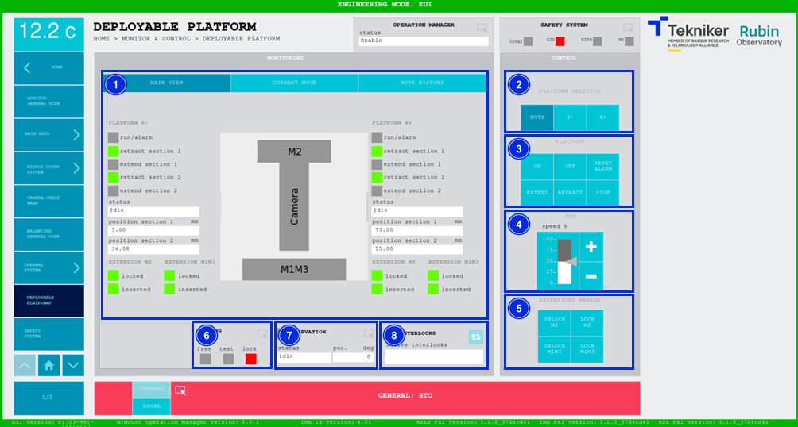
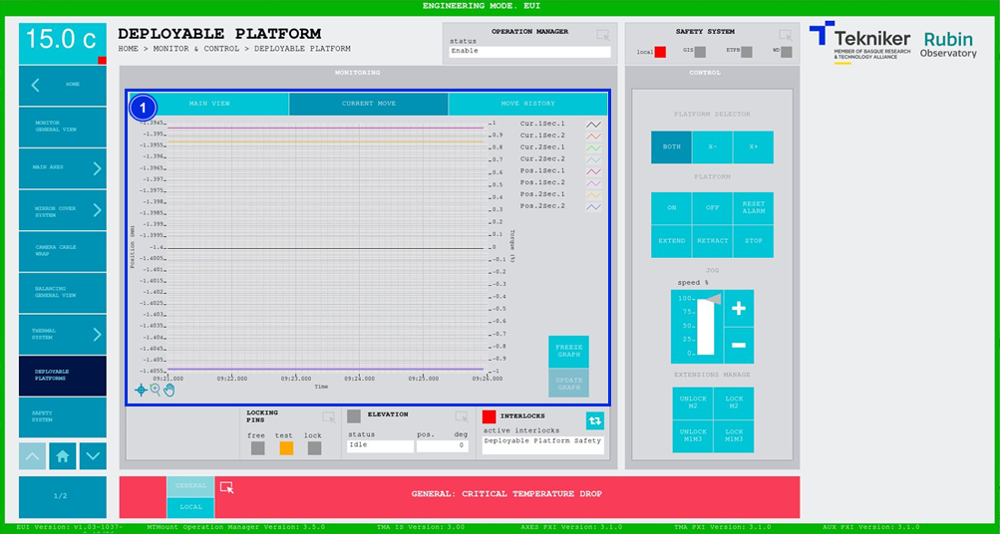
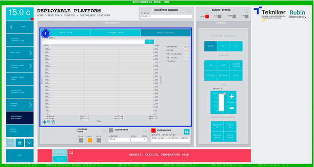

#### Pantalla Deployable Platforms

##### Pantalla Deployable Platforms -- Main View

Esta pantalla muestra y permite controlar las plataformas desplegables.

*Figura 2‑65. Pantalla deployable platforms - main view.*

<table>
<colgroup>
<col style="width: 13<col style="width: 86</colgroup>
<thead>
<tr class="header">
<th>ITEM</th>
<th>DESCRIPCIÓN</th>
</tr>
</thead>
<tbody>
<tr class="odd">
<td>1</td>
<td>
Muestra el estado, la posición de la sección 1 (en mm) y la posición de la sección 2 (en mm) de cada
plataforma.

El recuadro junto a “run/alarm” se ilumina con el color correspondiente al estado de cada plataforma.

Se iluminan los leds correspondientes a “retract”, de color verde, cuando las secciones de las plataformas
correspondientes están recogidas.

Se iluminan los leds correspondientes a “extend”, de color verde, cuando las secciones de las plataformas
correspondientes están extiendidas.

Se iluminan los leds correspondientes a “locked”, de color verde, cuando las extensiones correspondientes se
bloquean.

Se iluminan los leds correspondientes a “inserted” de color verde, cuando las extensiones correspondientes se
recogen.
</td>
</tr>
<tr class="even">
<td>2</td>
<td>
Softkey “BOTH”: Permite seleccionar ambas plataformas.

Softkeys “X-” y “X+”: Permiten seleccionar la plataforma correspondiente.
</td>
</tr>
<tr class="odd">
<td>3</td>
<td>
Softkey “ON”: Permite encender el sistema, si no hay ningún interlock activo.

Softkey “OFF”: Permite apagar el sistema.

Softkey “RESET ALARM”: Permite resetear el sistema del estado de alarma en el que se encuentra o resetear el
interlock en caso de haberlo.

Softkey “EXTEND”: Permite extender la plataforma previamente seleccionada.

Softkey “RETRACT”: Permite retraer la plataforma previamente seleccionada.

Softkey “STOP”: Permite parar el movimiento.
</td>
</tr>
<tr class="even">
<td>4</td>
<td>Softkeys “+” o “-”: Permiten hacer un movimiento a velocidad constante en dirección positiva o negativa
respectivamente. De esta manera, se ajusta el porcentaje de la velocidad por defecto definida en los parámetros con el
slider vertical.</td>
</tr>
<tr class="odd">
<td>5</td>
<td>
Softkeys “UNLOCK M2” y “UNLOCK M1M3”: Permiten desbloquear las extensiones de las plataformas correspondientes.
Las extensiones del lado de M1M solo se pueden extender con el “Mirror Cover” recogido.

Softkeys “LOCK M2” y “LOCK M1M3”: Permiten bloquear las extensiones de las plataformas correspondientes.

<table>
<colgroup>
<col style="width: 10<col style="width: 89</colgroup>
<tbody>
<tr class="odd">
<td></td>
<td>Para poder bloquear las extensiones de las plataformas, estas tienen que estar insertadas. Insertar las extensiones
(así como extraerlas) es una acción que ha de realizarse de forma manual desde la propia plataforma.</td>
</tr>
</tbody>
</table></td>
</tr>
<tr class="even">
<td>6</td>
<td>
Permite acceder a la pantalla [“Locking Pins General View”](./004_PantallaLockingPins.md)

Muestra el estado de los pasadores, y activa el led con el color correspondiente:

<ul>
<li>
“FREE”: Significa que los pasadores se encuentran libres, y se ilumina de color verde.
</li>
<li>
“TEST”: Significa que los pasadores se encuentran en test, y se ilumina de color naranja.
</li>
<li>
“LOCK”: Significa que los pasadores se encuentran bloqueados, y se ilumina de color rojo.
</li>
</ul></td>
</tr>
<tr class="odd">
<td>7</td>
<td>
Muestra el estado y la posición (en deg) de “Elevation”.

Permite acceder a la pantalla [“Elevation General View”](./002_PantallaElevationGeneralView.md)
</td>
</tr>
<tr class="even">
<td>8</td>
<td>
Softkey azul permite navegar entre los interlocks que se encuentran activos, en caso de haber más de uno.

Al haber algún interlock activo, el recuadro superior se visualiza de color rojo. Si no hay interlocks activos, el
recuadro se visualizará en verde y no se podrá pulsar el softkey azul.
</td>
</tr>
</tbody>
</table>

##### Pantalla Deployable Platforms -- Current Move

Esta pantalla muestra un gráfico con el movimiento de las plataformas desplegables en tiempo real.

*Figura 2‑66. Pantalla deployable platforms - current view.*

<table>
<colgroup>
<col style="width: 13<col style="width: 86</colgroup>
<thead>
<tr class="header">
<th>ITEM</th>
<th>DESCRIPCIÓN</th>
</tr>
</thead>
<tbody>
<tr class="odd">
<td>1</td>
<td>
Muestra el gráfico del movimiento de las plataformas desplegables en tiempo real.

Softkey “FREEZE GRAPH”: Permite congelar el gráfico.

Softkey “UPDATE GRAPH”: Permite actualizar el gráfico, tras haber sido congelado.
</td>
</tr>
</tbody>
</table>

##### Pantalla Deployable Platforms -- Move History

Esta pantalla muestra y permite cargar los últimos cinco movimientos de las plataformas desplegables, siendo el número 1
el último.

*Figura 2‑67. Pantalla deployable platforms - move history.*

<table>
<colgroup>
<col style="width: 13<col style="width: 86</colgroup>
<thead>
<tr class="header">
<th>ITEM</th>
<th>DESCRIPCIÓN</th>
</tr>
</thead>
<tbody>
<tr class="odd">
<td>1</td>
<td>
Softkey “LOAD”: Permite cargar los últimos cinco movimientos.

Tras seleccionar el movimiento deseado, permite visualizarlo en el gráfico.
</td>
</tr>
</tbody>
</table>
