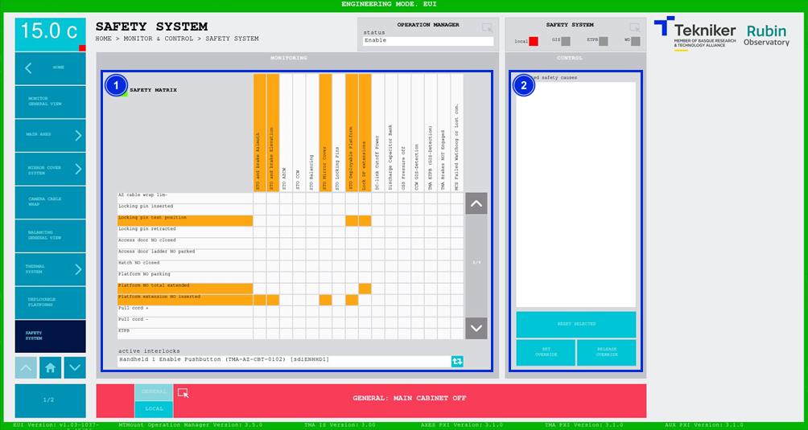

#### Pantalla Safety System

Esta pantalla muestra en forma de matriz el sistema de seguridad. Siendo las filas las causas, y las columnas los
subsistemas/efectos. Cuando una fila se activa, se colorean los cuadros correspondientes a los subsistemas/efectos
afectados por dicha causa. Existen cuatro colores diferentes:

- Blanco: No hay interlock activo.

- Naranja: Existe un interlock activo. No requiere operación por parte del operador, una vez solucionada la causa, se
  libera sin necesidad de reset.

- Rojo: Existe un interlock activo. La causa que origina el interlock requiere ser reseteada por parte del operario
  una vez solucionada.

- Morado: override, inhabilita la causa, por un tiempo determinado (180s). Si la causa no se libera y se resetea
  durante este tiempo vuelve a aparecer el interlock.

*Figura 2‑68. Pantalla safety system.*

<table>
<colgroup>
<col style="width: 13<col style="width: 86</colgroup>
<thead>
<tr class="header">
<th>ITEM</th>
<th>DESCRIPCIÓN</th>
</tr>
</thead>
<tbody>
<tr class="odd">
<td>1</td>
<td>
Muestra la matriz compuesta por causas y subsistemas.

Permite navegar entre los interlocks.

Permite seleccionar las causas deseadas, que se añadirán a la lista del item 2.
</td>
</tr>
<tr class="even">
<td>2</td>
<td>
Muestra las causas seleccionadas.

Softkey “RESET SELECTED”: Permite resetear la causa (o causas) seleccionada/s. Si la causa no está activa se
reseteará, si sigue activa no se reseteará.

Softkey “SET OVERRIDE”: override permite exceder el límite establecido, en aquellos parámetros en los que así lo
permiten. Esta acción dura un tiempo determinado (180s). Si la causa no se libera y se resetea durante este tiempo,
vuelve a aparecer el interlock.

Softkey “RELEASE OVERRIDE”: Permite liberar el parámetro y deja de ser posible exceder su límite.
</td>
</tr>
</tbody>
</table>
