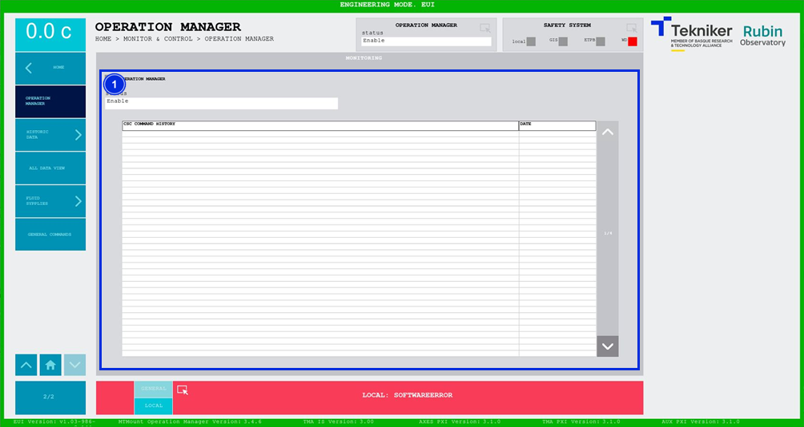

#### Pantalla Operation Manager

Esta pantalla muestra un histórico de todos los comandos enviados por el CSC. Es una pantalla únicamente de
monitorización.

*Figura 2‑69. Pantalla operation manager.*

<table>
<colgroup>
<col style="width: 13<col style="width: 86</colgroup>
<thead>
<tr class="header">
<th>ITEM</th>
<th>DESCRIPCIÓN</th>
</tr>
</thead>
<tbody>
<tr class="odd">
<td>1</td>
<td>
Muestra el estado de la aplicación de C++ que recibe los comandos y los envía al PXI, llamada “MtMount Operation
Manager”. Ilumina el recuadro superior con el color correspondiente.

Se visualiza una lista con el histórico de comandos recibidos desde el CSC junto con su respectiva fecha.

Softkeys de flechas permiten subir y bajar sobre la lista, cuando esta ocupa más de una página.
</td>
</tr>
</tbody>
</table>
