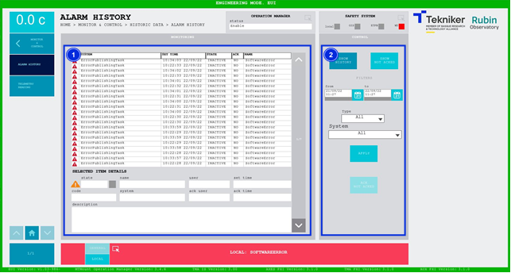

#### Pantalla Alarm History

Esta pantalla muestra y permite controlar el histórico de alarmas del sistema.

*Figura 2‑70. Pantalla alarm history.*

<table>
<colgroup>
<col style="width: 13<col style="width: 86</colgroup>
<thead>
<tr class="header">
<th>ITEM</th>
<th>DESCRIPCIÓN</th>
</tr>
</thead>
<tbody>
<tr class="odd">
<td>1</td>
<td>
Se visualiza una lista con el histórico de alarmas.

Al pulsar sobre una de las alarmas, se muestran en la parte inferior sus detalles.
</td>
</tr>
<tr class="even">
<td>2</td>
<td>
Softkey “SHOW HISTORY”: Permite mostrar el histórico en la lista, leído de un archivo.

Softkey “SHOW NOT ACKED”: Permite mostrar las alarmas marcadas como no vistas. Estas son aquellas que tienen un “NO”
escrito en la columna “ACK”.

Permite aplicar una serie de filtros para facilitar la búsqueda como son las fechas de inicio y final, el tipo de
alarma o el sistema.

Softkey “APPLY”: Permite aplicar los filtros en la búsqueda.

Softkey “ACK NOT ACKED”: Permite marcar como vistas las alarmas que no lo están, sólo cuando está seleccionado el
softkey “SHOW NOT ACKED”.
</td>
</tr>
</tbody>
</table>
