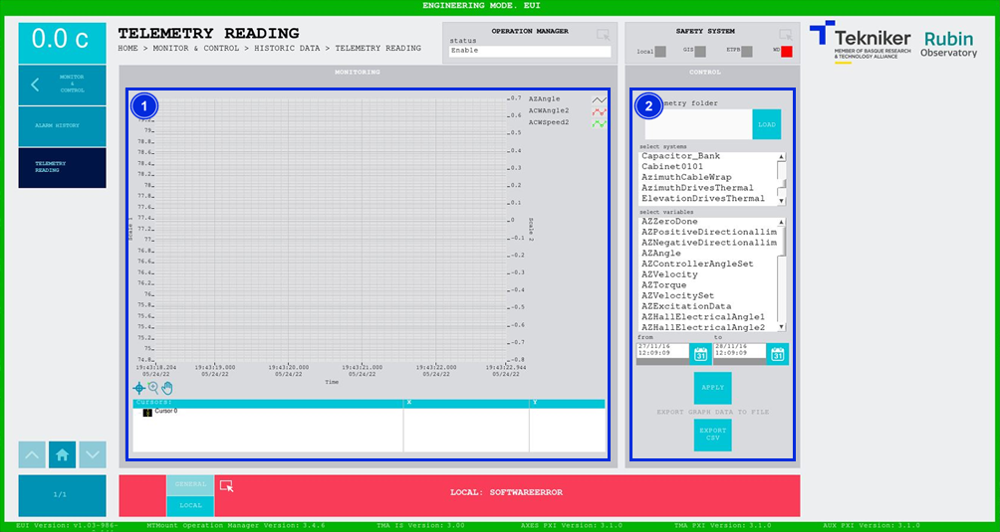

#### Pantalla Telemetry Reading

Esta pantalla permite analizar la telemetría guardada localmente. La telemetría disponible para esta ventana es de 1
hora, sin embargo, la telemetría almacenada localmente es de 2 días. Para acceder a datos más antiguos a 1 hora, hay que
descomprimir los archivos de telemetría y guardarlos en una ubicación diferente. Esta ubicación se indicará al cargar
los datos, para acceder a esos datos más antiguos.

*Figura 2‑71. Pantalla telemetry reading.*

<table>
<colgroup>
<col style="width: 13<col style="width: 86</colgroup>
<thead>
<tr class="header">
<th>ITEM</th>
<th>DESCRIPCIÓN</th>
</tr>
</thead>
<tbody>
<tr class="odd">
<td>1</td>
<td>Se visualiza una gráfica con el histórico de datos de telemetría cargados.</td>
</tr>
<tr class="even">
<td>2</td>
<td>
Softkey “LOAD”: Permite seleccionar el archivo de telemetría deseado.

Se puede filtrar la selección eligiendo los sistemas y las variables deseadas, en función de los sistemas
seleccionados las variables disponibles variarán. Para poder seleccionar más de una opción al mismo tiempo, mantener
pulsado “ctrl”. Además, se puede filtrar por periodo de tiempo acotando fecha de inicio y fecha final.

Softkey “APPLY”: Permite aplicar los filtros en la búsqueda.

Softkey “EXPORT CSV”: Permite exportar la información a un archivo de tipo CSV.
</td>
</tr>
</tbody>
</table>
