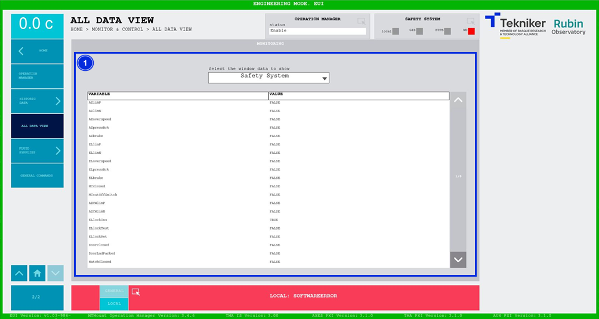

#### Pantalla All Data View

Esta pantalla muestra la lista de datos de cualquier subsistema (topic) en tiempo real. Es una pantalla únicamente de
monitorización.

*Figura 2‑72. Pantalla all data view.*

<table>
<colgroup>
<col style="width: 13<col style="width: 86</colgroup>
<thead>
<tr class="header">
<th>ITEM</th>
<th>DESCRIPCIÓN</th>
</tr>
</thead>
<tbody>
<tr class="odd">
<td>1</td>
<td>
Esta pantalla permite visualizar la lista de datos de cualquier subsistema en tiempo real, junto con sus
respectivos valores.

La ventana desplegable superior permite seleccionar el subsistema.
</td>
</tr>
</tbody>
</table>
