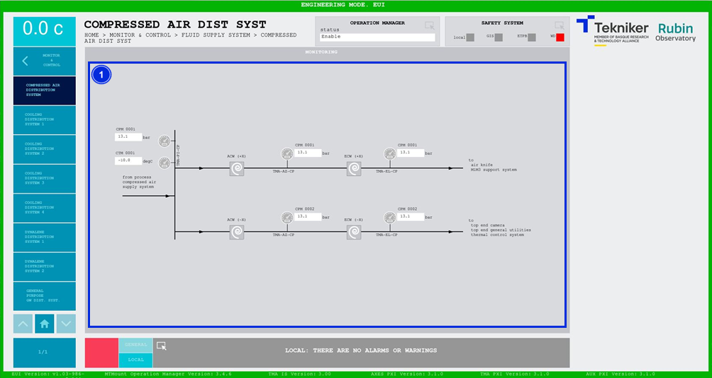

#### Pantalla Compressed Air Distribution System

Esta pantalla muestra las presiones y temperaturas del sistema de distribución de aire comprimido. Es una pantalla
únicamente de monitorización.

*Figura 2‑73. Pantalla compressed air distribution system.*

| ITEM | DESCRIPCIÓN                                                                                               |
|------|-----------------------------------------------------------------------------------------------------------|
| 1    | Muestra las presiones (en bar) y la temperatura (en degC) del sistema de distribución de aire comprimido. |
