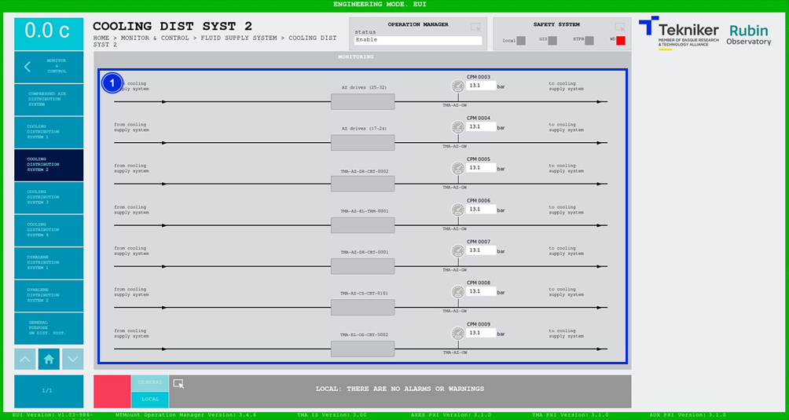

#### Pantalla Cooling Distribution System 2

Esta pantalla muestra las presiones del sistema de refrigeración. Es una pantalla únicamente de monitorización.

*Figura 2‑75. Pantalla cooling distribution system 2.*

| ITEM | DESCRIPCIÓN                                                  |
|------|--------------------------------------------------------------|
| 1    | Muestra las presiones (en bar) del sistema de refrigeración. |
