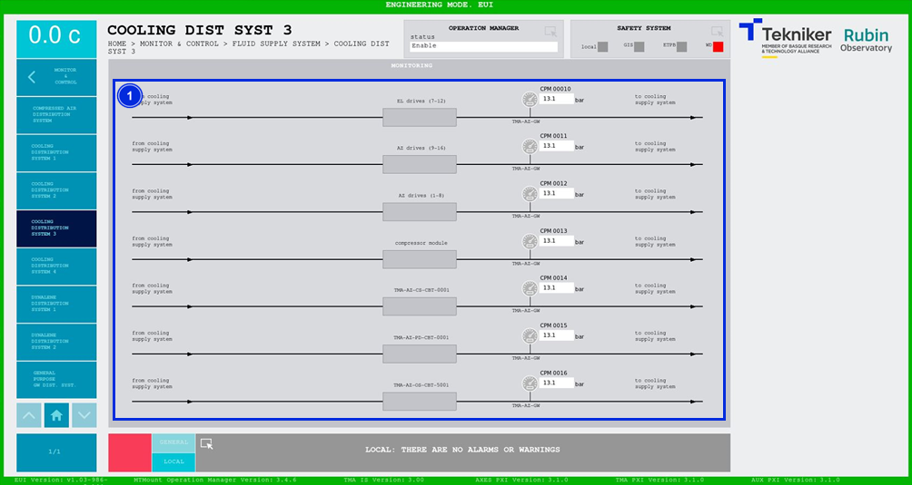

#### Pantalla Cooling Distribution System 3

Esta pantalla muestra las presiones del sistema de refrigeración. Es una pantalla únicamente de monitorización.

*Figura 2‑76. Pantalla cooling distribution system 3.*

| ITEM | DESCRIPCIÓN                                                  |
|------|--------------------------------------------------------------|
| 1    | Muestra las presiones (en bar) del sistema de refrigeración. |
