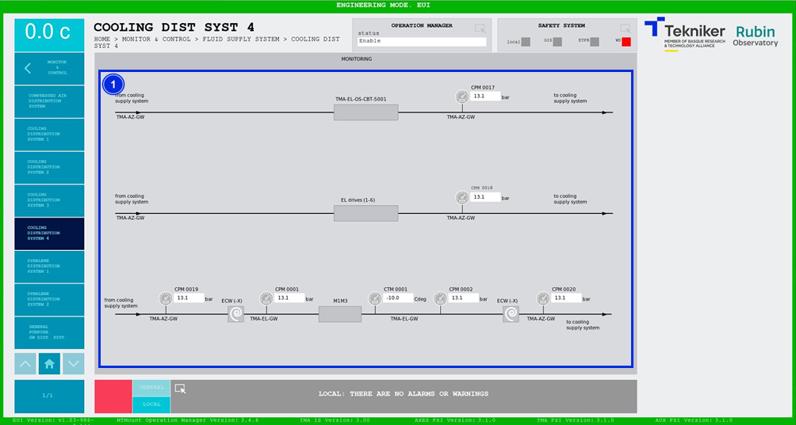

#### Pantalla Cooling Distribution System 4

Esta pantalla muestra las presiones y temperaturas del sistema de refrigeración. Es una pantalla únicamente de
monitorización.

*Figura 2‑77. Pantalla cooling distribution system 4.*

| ITEM | DESCRIPCIÓN                                                                             |
|------|-----------------------------------------------------------------------------------------|
| 1    | Muestra las presiones (en bar) y la temperatura (en Cdeg) del sistema de refrigeración. |
