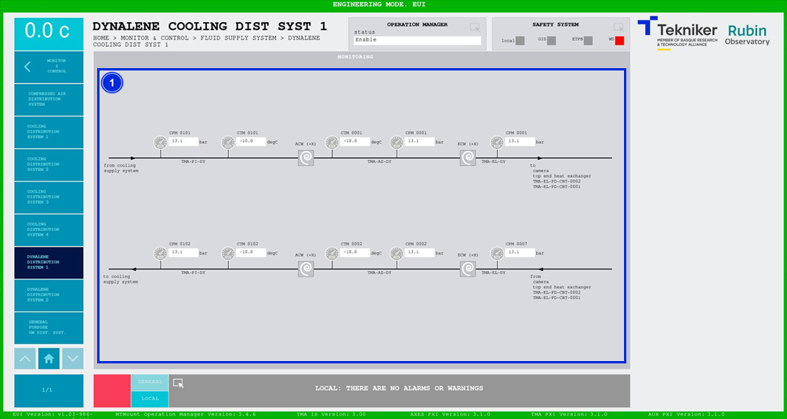

#### Pantalla Dynalene Cooling Distribution System 1

Esta pantalla muestra las presiones y temperaturas del sistema de refrigeración con Dynalene. Es una pantalla únicamente
de monitorización.

*Figura 2‑78. Pantalla dynalene cooling distribution system 1.*

| ITEM | DESCRIPCIÓN                                                                                            |
|------|--------------------------------------------------------------------------------------------------------|
| 1    | Muestra las presiones (en bar) y las temperaturas (en degC) del sistema de refrigeración con Dynalene. |
