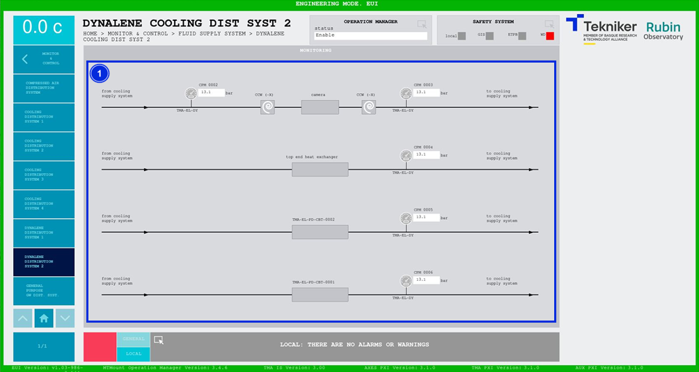

#### Pantalla Dynalene Cooling Distribution System 2

Esta pantalla muestra las presiones y temperaturas del sistema de refrigeración con Dynalene. Es una pantalla únicamente
de monitorización.

*Figura 2‑79. Pantalla dynalene cooling distribution system 2.*

| ITEM | DESCRIPCIÓN                                                               |
|------|---------------------------------------------------------------------------|
| 1    | Muestra las presiones (en bar) del sistema de refrigeración con Dynalene. |
