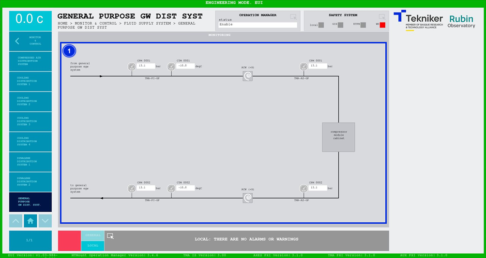

#### Pantalla General Purpose GW Dist. Syst.

Esta pantalla muestra las presiones del sistema de distribución de propósito general de glicol (General Purpose Glycol
Distribution System). Es una pantalla únicamente de monitorización.

*Figura 2‑80. Pantalla general purpose gw dist. syst.*

| ITEM | DESCRIPCIÓN                                                                                             |
|------|---------------------------------------------------------------------------------------------------------|
| 1    | Muestra las presiones (en bar) y las temperaturas (en degC) del sistema de propósito general de glicol. |
