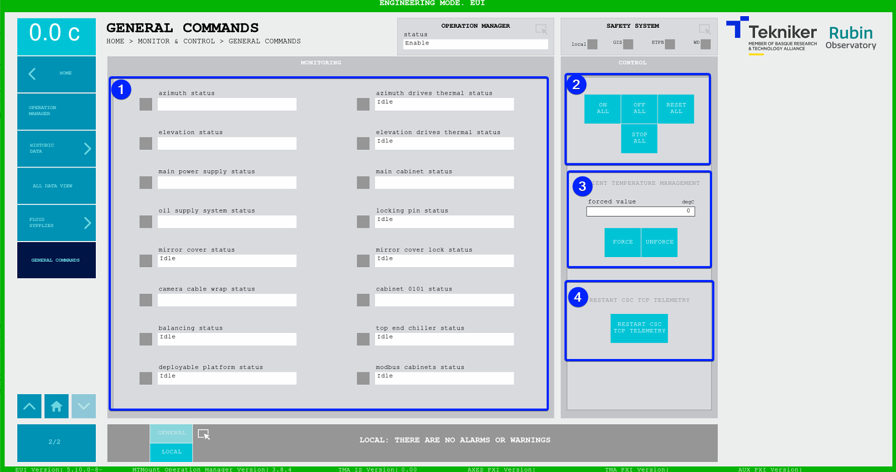

#### Pantalla General Commands

Esta pantalla muestra todos los sistemas y permite enviar los comandos generales a todos los sistemas.

*Figura 2‑81. Pantalla general commands.*

<table>
<colgroup>
<col style="width: 13<col style="width: 86</colgroup>
<thead>
<tr class="header">
<th>ITEM</th>
<th>DESCRIPCIÓN</th>
</tr>
</thead>
<tbody>
<tr class="odd">
<td>1</td>
<td>
Muestra el estado de los subsistemas más generales. En base al estado en el que se encuentren, se pueden ver los
siguientes colores:

<ul>
<li>
Gris, significa que el sistema se encuentra apagado.
</li>
<li>
Verde, significa que el sistema se encuentra encendido.
</li>
<li>
Rojo, significa que el sistema tiene un fallo.
</li>
</ul></td>
</tr>
<tr class="even">
<td>2</td>
<td>
Softkey “ON”: Permite encender todo.

Softkey “OFF”: Permite apagar todo.

Softkey “RESET ALL”: Permite resetear todo.

Softkey “STOP ALL”: Permite pararlo todo.
</td>
</tr>
<tr class="odd">
<td>3</td>
<td>
Softkey “FORCE”: Permite forzar la temperatura ambiente. Se actualiza el valor mostrado en la parte superior
izquierda de la pantalla y aparece un recuadro rojo para indicar que el valor está forzado.

Softkey “UNFORCE”: Permite dejar de forzar la temperatura ambiente.
</td>
</tr>
<tr class="even">
<td>4</td>
<td>
Softkey “RESTART TCP TELEMETRY”: Permite reiniciar el servidor de telemetría TCP que envía la telemetría al
CSC.

Softkey “STOP PXI APP”: Permite apagar el control del PXI principal.
</td>
</tr>
</tbody>
</table>
