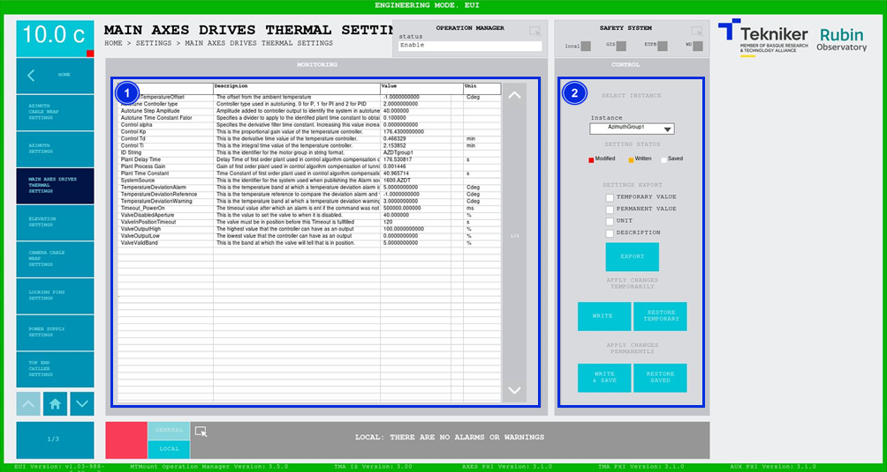

#### Pantalla Main Axis Drives Thermal Settings

Esta pantalla muestra y permite controlar la lista de parámetros térmicos de los motores de los ejes principales.

*Figura 2‑84. Pantalla main axis drives thermal settings.*

<table>
<colgroup>
<col style="width: 13<col style="width: 86</colgroup>
<thead>
<tr class="header">
<th>ITEM</th>
<th>DESCRIPCIÓN</th>
</tr>
</thead>
<tbody>
<tr class="odd">
<td>1</td>
<td>Muestra la lista de parámetros térmicos de los motores de los ejes principales.</td>
</tr>
<tr class="even">
<td>2</td>
<td>
Permite modificar los valores de los parámetros de las diferentes instancias.

Desplegable “Instance”: Permite seleccionar la instancia deseada del subsistema, en este caso es el grupo de
motores.

Softkey “EXPORT”: Permite exportar los datos seleccionados en la parte superior.

Softkey “WRITE”: Permite aplicar el cambio realizado en un parámetro. El subsistema usa este valor en el siguiente
encendido.

Softkey “RESTORE TEMPORARY”: Permite recuperar los valores escritos, es decir, los que están guardados como
“Write”.

Softkey “WRITE &amp; SAFE”: Permite cambiar los parámetros modificados (los usados por el subsistema) y guardarlos en
la base de datos de forma permanente.

Softkey “RESTORE SAVED”: Permite recuperar los valores guardados “Save”, definitivos, de la base de datos.
</td>
</tr>
</tbody>
</table>
