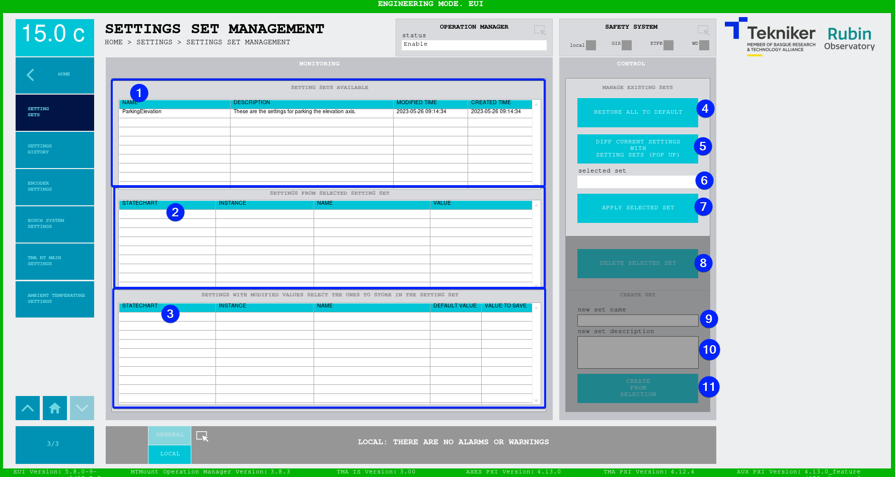

#### Pantalla Settings Set Management

Esta pantalla muestra y permite manejar diferentes sets de parámetros. Los parámetros aplicados afectan a todos los
elementos del MCS.

*Figura 2‑97. Pantalla settings set management.*

| ITEM | DESCRIPCIÓN                                                    |
|------|----------------------------------------------------------------|
| 1    | Muestra la lista de setting sets disponibles                   |
| 2    | Muestra los settings contenidos en el setting set seleccionado |
| 3    | Muestra la lista de settings que tienen un valor en uso diferente al valor por defecto. Son estos settings los que se pueden seleccionar y guardar en un setting set nuevo al crearlo, si no se selecciona ninguno, el setting set no se creará |
| 4   | "RESTORE ALL TO DEFAULT": restablece todos los settings a sus valores por defecto |
| 5   | "DIFF CURRENT SETTINGS WITH SETTING SETS (POP UP)": abre una ventana emergente, [ver](#diff-current-settings-with-setting-sets-pop-up) |
| 6   | "selected set": muestra el nombre del setting set seleccionado |
| 7   | "APPLY SELECTED SET": aplica el setting set seleccionado modificando los valores en uso |
| 8   | "DELETE SELECTED SET": elimina el setting set seleccionado, esta acción al no ser reversible pide confirmación por medio de una ventana emergente de SI o NO |
| 9   | "new set name": nombre para crear un nuevo setting set (obligatorio para crear un set) |
| 10  | "new set description": descripción del set (opcional para crear un set) |
| 11  | "CREATE FROM SELECTION": crea un nuevo setting set con el nombre y la descripción especificados, en el que se incluyen los valores seleccionados en el *item 3* |

##### DIFF CURRENT SETTINGS WITH SETTING SETS (POP UP)

Esta pantalla se muestra al presionar "DIFF CURRENT SETTINGS WITH SETTING SETS (POP UP)" en la ventana "Settings Set
Management". Esta pantalla muestra los valores que van a ser modificados al aplicar el setting set seleccionado usando
el desplegable "setting set".

*Figura 2‑97.2. Pantalla diff current settings with settings sets.*
