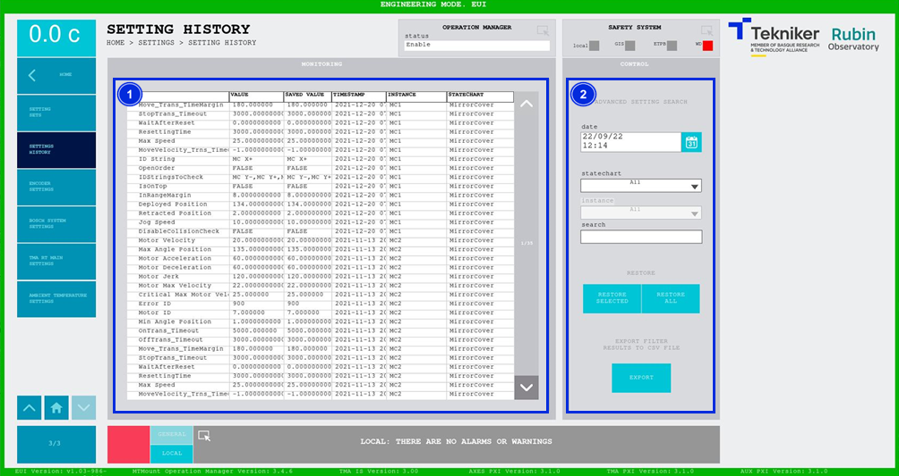

#### Pantalla Setting History

Esta pantalla muestra el histórico de parámetros. Además, permite aplicar los settings deseados.

*Figura 2‑98. Pantalla setting history.*

<table>
<colgroup>
<col style="width: 13<col style="width: 86</colgroup>
<thead>
<tr class="header">
<th>ITEM</th>
<th>DESCRIPCIÓN</th>
</tr>
</thead>
<tbody>
<tr class="odd">
<td>1</td>
<td>Muestra los parámetros que había en un momento determinado.</td>
</tr>
<tr class="even">
<td>2</td>
<td>
Permite trabajar con el historial de parámetros.

Permite filtrar la búsqueda de parámetros para facilitar el trabajo, pudiendo filtrar según fecha, subsistema,
instancia o texto.

Softkey “RESTORE SELECTED”: Permite restaurar el parámetro seleccionado.

Softkey “RESTORE ALL”: Permite restaurar todos los parámetros.

Softkey “EXPORT”: Permite exportar la información del parámetro.
</td>
</tr>
</tbody>
</table>
