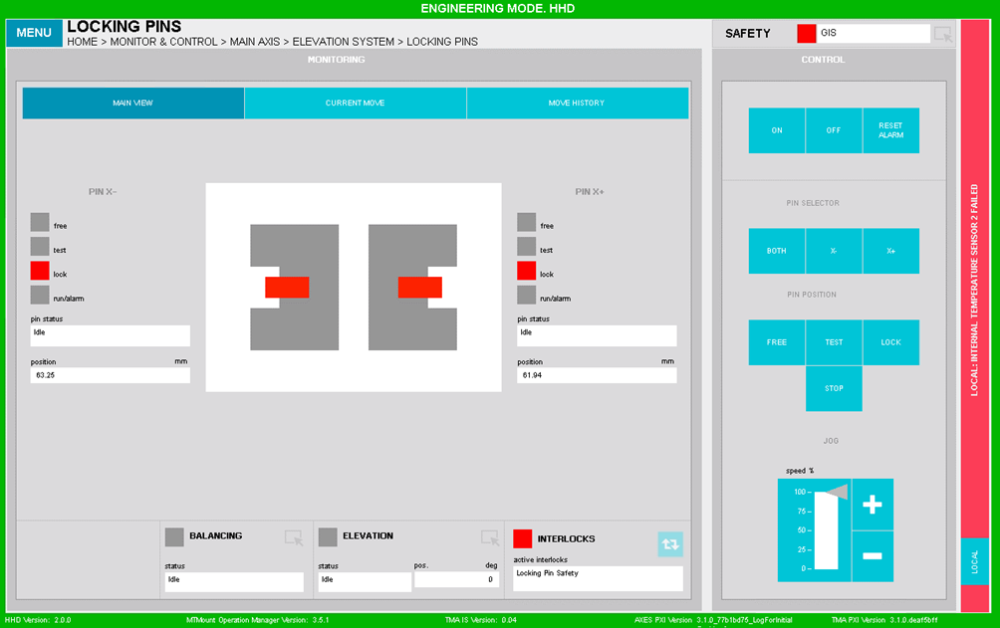
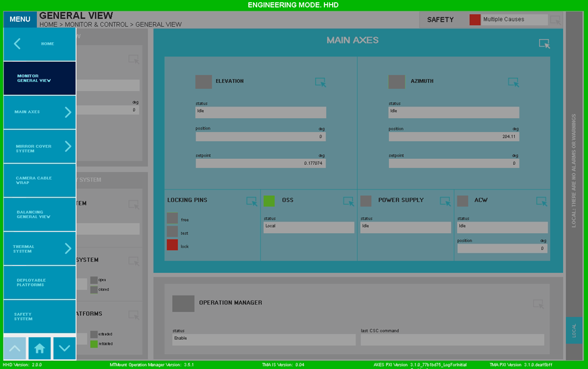
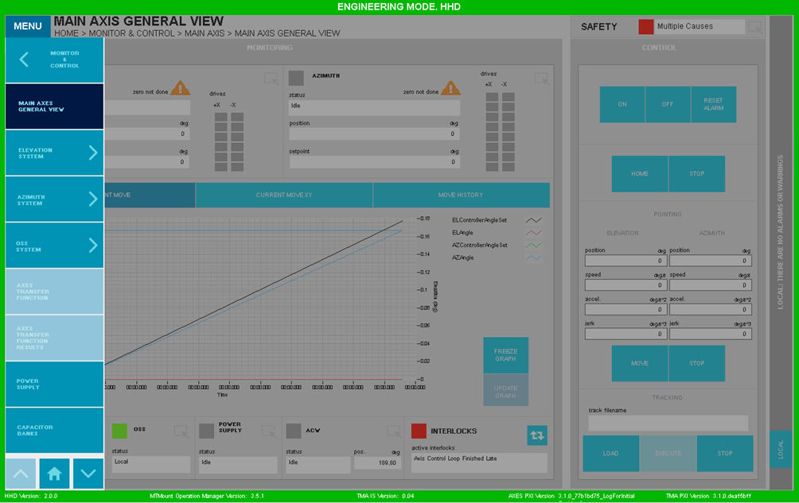

#### Elementos Comunes de Pantallas

Las pantallas del HHD son muy similares a las del EUI. En la Figura 2‑103 se puede ver que la estructura de "Monitoring"
y de "Control" es la misma.

*Figura 2‑103. Ejemplo pantalla HHD.*

El mayor cambio en las pantallas HHD es el menú desplegable. En estas pantallas el menú se despliega y se contrae al
pulsar sobre el softkey "Menu" que se puede ver arriba a la izquierda en la Figura 2‑104.

*Figura 2‑104. Ejemplo menú deplegable.*

Otra diferencia es la barra de alarmas/warnings. Para la pantalla EUI esta se encuentra en la parte inferior de las
pantallas, en el caso del HHD, está situada de forma vertical en el lateral derecho.

Por último, el acceso a "Operation Manager" desaparece, y el acceso a "Safety System" se reduce en tamaño y contenido,
pasando de varios leds a un led y una explicación de la causa activa en caso de ser única, en caso de haber múltiples
aparecerá el texto "Multiple Causes".

Además, algunas de las ventanas están deshabilitadas para el HHD, ver Figura 2‑105.

*Figura 2‑105. Ejemplo pantalla deshabilitada.*

