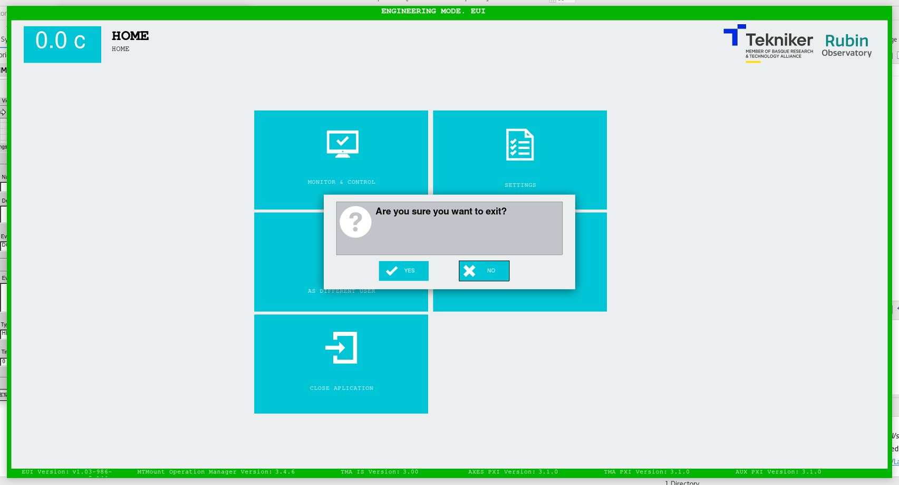

### CIERRE DE APLICACIÓN

Tras pulsar el softkey "CLOSE APPLICATION", [ver](../01_Descripci%C3%B3n%20de%20Pantallas/01_Pantalla_Inicio_HOME.md),
se muestra el siguiente mensaje de confirmación de cierre de aplicación, ver Figura 2‑106:

- YES: Permite cerrar la aplicación.

- NO: Permite continuar en la aplicación.

*Figura 2‑106. Pantalla confirmación de cierre.*
